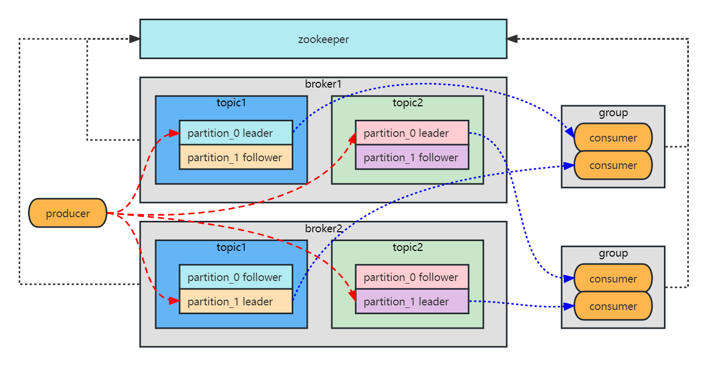

# Kafka

[TOC]

## 1. 架构

### 1.1 架构图

### 1.2 适用场景

-   活动跟踪
-   传递消息
-   收集指标或日志
-   提交日志
-   流式处理

## 2. 相关概念

### 2.1 ZooKeeper

-   /brokers/ids
    -   保存所有的 Broker 的信息，包括物理地址、版本信息、启动时间等
    -   Broker 定时发心跳到 Zookeeper，如果失联则该 Broker 信息会被删除
-   /brokers/topics
    -   保存 Broker 下的所有 Topic 的信息
    -   每个 Topic 下包含一个固定的 Partitions 节点
    -   Partitions 的子节点就是 Partition 节点，即当前 Topic 的一个分区
    -   每个 Partition 下包含一个 State 节点，包含当前 Partition 的 Leader 和 ISR 的 BrokerID，State 节点由 Leader 创建，如果 Leader 失联则 State 节点会被删除，直到新的 Leader 选举产生并重新创建 State 节点
-   /consumers/{group_id}/owners/{topic}/{broker_id-partition_id}
    -   维护消费者和 Partition 的关系
-   /consumers/{group_id}/offsets/{topic}/{broker_id-partition_id}
    -   维护 Partition 的消费进度

### 2.2 Topic 和 Partition

-   Topic
    
    -   Topic 把消息分类，生产者和消费者面向的是同一个 Topic
-   Partition
    -   一个 Topic 以多个 Partition 的方式分布在多个 Broker 上，每个 Partition 是一个有序的队列
    -   每个 Partition 都有若干个 Replication：一个 Leader 和若干个 Follower。其中 Leader 负责消息的接收和投递，而 Follower 只作为备份，负责实时从 Leader 中同步数据，在 Leader 发生故障时，某个 Follwer 会成为新的 Leader
    -   分区键 Key
        -   生产者指定 Key 时，会对 Key 做 HASH 操作，写入指定的 Partition
        -   生产者 不指定 Key，则轮询写入 Partition

### 2.3 消费组 和 消费者

-   普通消费者
    -   组内的每个消费者负责不同 Partition 的消费
    -   每个消费组的第一个加入的消费组，作为当前消费组的 Leader ，会维护当前消费组的 Partition 和消费者的对应关系

-   独立消费者
    -   没有消费组
    -   不需要订阅 Topic，直接分配某个 Topic 的 Partition
    -   场景：一个消费者从一个 Topic 的所有 Partition 或者特定的 Partition 进行精确消费，这种情况下不需要消费组

### 2.4 ISR

-   标志位
    -   LogStartOffset：起始位置
    -   LastStableOffset：最后一条已提交数据
    -   FisrtUnstableOffset：第一条未提交数据
    -   HW：High Watermark，标记特定的偏移量，消费者只能消费 HW 之前的数据
    -   LEO：LogEndOffset，下一条待写位置
-   同步步骤
    1.  Leader 接收消息，更新本地的 LEO
    2.  Follower 发送同步请求，请求中包含自己的 LEO
    3.  Leader 接收到同步请求，把所有的 Follower 中最小的 LEO 作为整个 Partition 的 HW，并返回给 Follower
    4.  Follower 接收到应答，更新自己的 HW，更新为 MIN(响应中的 HW，自己的 LEO)，自己的 LEO+1
-   配置参数
    -   replica.lag.time.max.ms
    -   意义：
        -   在过去的 replica.lag.time.max.ms 时间内，Follower 已经追赶上 Leader 一次，而不是简单的在此时间内有同步消息
        -   当 Leader 的消息写入速度大于 Follower 的同步速度时，Follower 与 Leader 的差距会越来越大，这种情况下仅参考在参数时间内有同步操作将没有任何意义

### 2.5 Rebalance

-   定义
    -   消费组中的消费者与 Topic 下的 Partition 重新匹配的过程
-   时机
    -   消费组中的消费者个数发生变化
    -   消费组订阅的 Topic 个数发生变化
    -   消费组订阅的 Topic 的 Partition 个数发生变化
    -   消费组中的消费者发生消费超时
-   协调者
    -   通常是 Partition 的 Leader 所在的 Broker
    -   通过消费者发送的心跳，监控消费组中消费者的存活，
-   步骤
    1.  协调者通过心跳返回，通知所有消费者进行 Rebalance，此时不能进行消费操作
    2.  所有消费者向协调者发送 JoinGroup 请求，通常第一个发送 Join Group 的消费者自动成为 Leader 消费者
    3.  协调者从所有的消费者中选择一个作为 Leader 消费者，并把选举结果通过 Join Group 应答返回给所有消费者
        -   Leader 消费者的 JoinGroup 应答中，包含所有消费者的订阅信息
        -   普通消费者的 JoinGroup 应答中，包含 Leader 消费者的信息
    4.  所有的消费者向协调者发送 syncGroup 请求
        -   Leader 消费者的 syncGroup 请求中包含重新分配后的匹配方案
        -   普通消费者的 syncGroup 请求类似于心跳
    5.  协调者把重新分配后的匹配方案，通过 syncGroup 应答返回给各消费者
-   导致问题
    -   消费者 C1 消费超时，触发 Rebalance，该条消息被消费者 C2 消费，此时 C1 完成消费并提交 offset，与 C2 提交的 offset 冲突
-   解决方案
    -   标记一个 Generation 到消费者，每次 Rebalance 会进行 +1 操作，提交 offset 时会比较 Generation ，不一致则拒绝提交

### 2.6 发送模型

-   Key
    -   指定 Key，则对 Key 做 Hash 操作，写入 Hash 结果对应的 Partition 中
    -   不指定 Key，自动以自增整数作为Key，实现轮询写入

-   三种方式
    -   发后即忘 producer.send()
    -   同步发送 producer.send().get()
    -   异步发送 producer.send().addCallback()
-   ACK 确认机制
    -   0：无确认
    -   1：默认值，Partition 的 Leader 确认收到
    -   -1：Partition 的 Leader 确认收到，并且所有的 Follower 都收到了 Leader 的同步

### 2.7 消费模型

-   pull
    -   优点
        -   消费端可以单条拉取，也可以批量拉取
        -   消费端可以根据自己的消费能力进行动态的控制
        -   消费端可以设置不同的提交方式
    -   缺点
        -   没有消息的时候，会空循环，消耗资源
-   push
    -   优点
        -   不会造成消费端循环等待
    -   缺点
        -   消费的速率固定，不能灵活改变，容易造成消费端的资源浪费，或者压垮消费端

### 2.8 存储模型

-   每个 Partition 有多个 Segment
-   每个 Segment 有两个文件，文件名前缀即当前 Segment 的第一个 offset 
    -   index 文件：索引文件，记录当前的 Segment 中的所有 offset 对应的消息在 log 文件中的偏移量
    -   log 文件：数据文件，记录当前 Segment 中的所有的消息
-   日志保存时间
    -   log.retention.hours
    -   过期删除，Segment 的最后修改时间 T 时间后即代表当前 Segment 可以被删除
-   日志分片大小
    -   log.segment.bytes
    -   每个 Segment 的 log 文件达到一定大小后，会进行分片转储

### 2.9 消息的顺序性

-   一个分区，一个 Partition
-   max.in.flight.requests.per.connection = 1
    -   生产者在接收到 Broker 的响应之前最多可以发送的消息个数，设置为 1 时，显然必须等待上一条消息的响应之后才可以发送下一条，避免重试机制带来的顺序破坏，显然会牺牲效率

### 2.10 消息的可靠性

-   生产端
    -   Ack：设置为 -1 或 all，等待 ISR 中所有的 Flower 确认完再返回，显然会牺牲性能
    -   unclean.leader.election.enable：设置为 false，禁止 ISR 之外的 Flower 被选举为 Leader，因为 ISR 之外的 Flower 与 Leader 的同步进度相差太多，显然有丢失消息风险。但是极端情况下，如果 ISR 中的所有 Flower 都离线，则无法选举出 Leader，此情况下整个 Kafka 集群不可用
    -   min.insync.replicas：设置为大于 1 的值，最小同步 Flower 数，未满足该值前，不提供读写服务，以此保证消息保存多个副本
    -   增加重试机制
-   Broker
    -   减小 PageCache 刷盘间隔
    -   开启事务消息
    -   ISR
-   消息端
    -   手动提交 offset

## 3. 高可用和高性能

### 3.1 消费者分区分配策略

#### 3.1.1 Range 策略

-   针对一个 Topic，连续分区分配
-   Topic 下的 Partition 总数除以消费组内的消费者总数
    -   除尽，则平均分配
    -   除不尽，则排序靠前的消费者会多负责一个 Partition

#### 3.1.2 Roundrobin 策略

-   针对所有的 Topic 和所有的消费组中的消费者，轮询分配

### 3.2 消费者 Offset 提交

-   偏移量表示消费者下一次要消费的位置，如当前已经消费到 N 位置的消息，则提交的 offset 的值为 N+1
-   消费组向名为 _consumer_offset 的特殊 Topic 发送消息，消息为每个分区的当前消费的偏移量
-   当消费组有消费者掉线，或新的消费者加入时，会触发 Rebalance，重新分配 Partition 与消费者的对应关系，但是这样就容易造成两类问题：
    -   重复消费：提交的偏移量小于客户端处理的最后一个偏移量
    -   消息丢失：提交的偏移量大于客户端处理的最后一个偏移量
-   为避免这种情况，可把消费者的自动提交改为手动提交：
    -   同步提交
    -   异步提交
    -   混合使用
    -   特定提交：由应用程序自定义在特定的时机进行提交，而不必等待一个批次之后再提交

### 3.3 性能影响因素

-   磁盘
    -   磁盘用于存储消息，所以影响最大的是生产者
-   内存
    -   消费时一般需要先把数据从磁盘读到内存，所以内存影响最大的是消费者
-   网络
    -   生产者
    -   消费者
    -   集群中 Broker 之间的消息同步
-   CPU
    -   一般不会成为性能瓶颈

### 3.4 高性能

#### 3.4.1 数据压缩

-   支持对消息的压缩，如 gzip 等，显然吞吐量更大

#### 3.4.2 批处理

-   一次传输多条消息，增大网络 IO 效率

#### 3.4.3 并行处理

-   多个生产者可以向 Topic 的多个 Partition 发送消息

#### 3.4.4 顺序读写

-   Broker 申请连续的磁盘空间进行顺序读写，磁盘的顺序读写速率远大于随机读写

#### 3.4.5 PageCache

-   Broker 直接操作系统 PageCache，而不是 JVM，避免了创建对象和 GC 的耗时
-   生产端
    -   Broker 收到的消息先写入 PageCache，然后跟随系统的 flush 进程和 sync 调用进行落盘
-   消费端
    -   消费时先从 PageCache 读取，没有数据时从磁盘加载，顺便把后续的连续消息预读到 PageCache 中

#### 3.4.6 零拷贝

-   生产端

    

    -   使用 MMAP 内存文件映射，实现顺序的磁盘快速写入

-   消费端

    

    -   使用 Sendfile，直接从 PageCache 到 SocketBuffer
