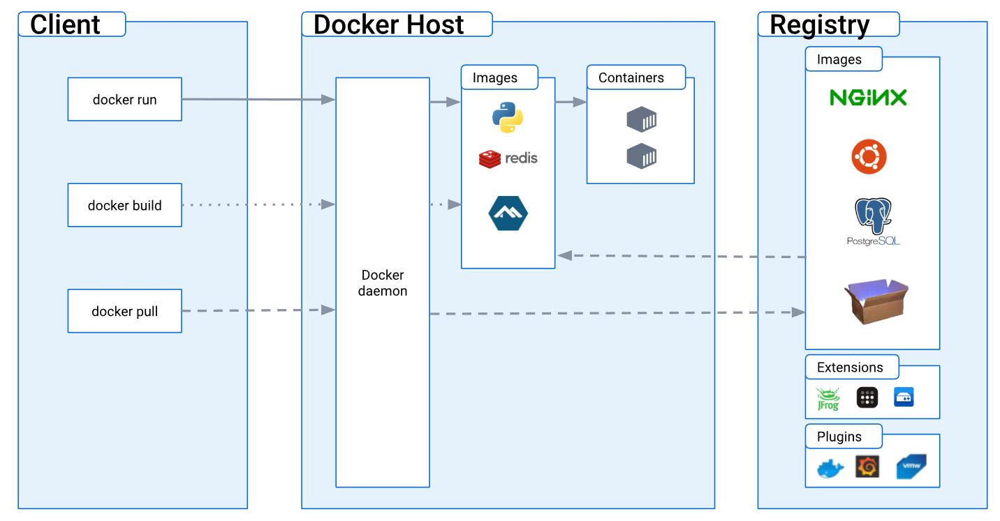
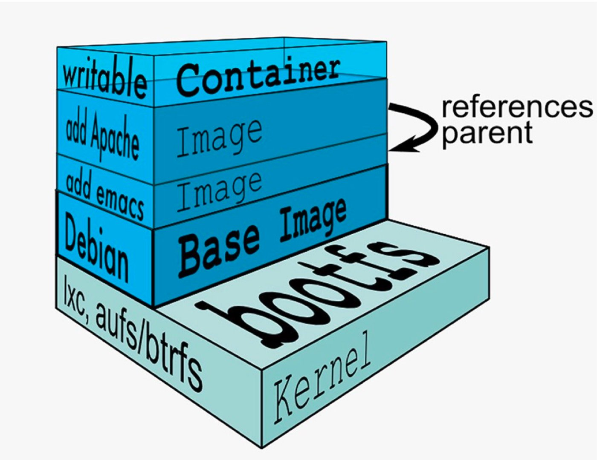

# Docker

[TOC]


## 1. 架构



-   Docker Client
    -   客户端，CLI工具，向引擎提交命令请求
-   Dockerd（Docker Daemon）
    -   通过 gRPC 与 Containerd 通信
    -   镜像构建、镜像管理、REST API、核心网络及编排
-   Containerd（Container Daemon）
    -   管理容器的生命周期
    -   自己不创建容器，而是 fork 出 Runc，由 Runc 创建容器
-   Runc（Run Container）
    -   OCI 容器运行时规范的实现，所以 Docked 不用再包含容器运行时的代码，简化了 Dockerd
    -   只有一个作用：fork 出一个子进程，启动容器，启动完毕后，Runc 自动退出
-   Shim
    -   实现 DaemonLess Container
    -   创建容器时，Containerd 除了 fork 出 Runc，还会 fork 出 Shim，当 Runc 自动退出时，Runc 的子进程会被过继给 Shim
    -   保持所有的 STDIN 和 STDOUT 流的开启，这样 Dockerd 重启时，容器不会因为 pipe 的关闭而终止，从而解耦容器与 Dockerd
    -   把容器的退出状态返回给 Dockerd

## 2. 原理

>   Linux 内核提供 Namespace 完成资源的隔离，Cgroup 完成资源的限制

### 2.1 Namespace

-   内核级别的环境隔离
    -   PID：进程，pid 为 1 的进程是其他所有进程的父进程
    -   IPC：进程间通信，信号量、消息队列、共享内存
    -   UTS：主机名、域名的隔离，独立的hostname标识
    -   USER：用户、用户组的隔离
    -   MNT：挂载点和文件系统的隔离，基于对chroot的改进
    -   NET：网络隔离

### 2.2 Cgroup

-   限制进程组的资源使用
-   记录进程组使用的资源
-   进程组的优先级控制
-   进程组隔离
-   进程组控制，挂起、恢复等操作

## 3. 对比

### 3.1 虚拟机

-   启动过程
    1.  Linux 系统开机
    2.  加载磁盘中的 Bootfs 中的 Bootloader
    3.  Bootloader 把 Kernel 加载到内存，引导 Kernel 启动
    4.  Kernel 启动后， 从 Bootfs 获取到内存的完全使用权
    5.  卸载 Bootfs
    6.  Kernal 把磁盘中 OS 其他部分加载到内存并启动
    7.  Linux 系统启动完毕

### 3.2 Docker

-   优点
    -   提供统一的运行环境
    -   应用迁移更便捷
    -   启动时间更快
    -   维护和扩展更轻松
    -   资源利用率更高

    -   部署交付更便捷

    

## 4. 镜像



### 4.1 镜像分层

-   原因：
    -   不同镜像之间的资源共享，上层镜像可以复用下层镜像
    -   方便镜像的分发和存储

-   Image 的本质是基于 UnionFS 管理的分层文件系统
    -   Union FIle System：联合文件系统，把不同的每一层，整合为一个文件系统，为用户隐藏了多层的视角
    -   Bootfs：主要包含 bootloader（引导加载 kernel）、kernel，Linux 启动时会加载 Bootfs
    -   Rootfs：不同操作系统的发行版，比如：Ubuntu、CentOS 等，主要包含 /dev、/proc、/bin、/etc 等标准目录和文件
-   Image 比完整的系统镜像小
    -   由于只有 Rootfs及以上的层，使用宿主机的Bootfs，因此Image要比完整的系统要小

### 4.2 镜像启动

-   启动一个容器时，会在 Image 的最顶层，添加一个writable的层，这一层通常被称为容器层，而此时下面的所有都被称为镜像层
-   所有对容器的修改动作，都只会发生在这个容器层
    -   添加文件：新文件被添加到容器层
    -   读取文件：读取某个文件时，会从上到下依次在各镜像层中查找此文件，找到后复制到容器层，然后打开并读取到内存
    -   修改文件：修改某个文件时，会从上到下依次在各镜像层中查找此文件，找到后复制到容器层，然后修改
    -   删除文件：修改某个文件时，会从上到下依次在各镜像层中查找此文件，找到后，在容器层记录删除操作

### 4.3 构建缓存

-   Build Cache 是一种对磁盘中镜像层的检索和复用机制，并不占用内存的 Cache，加快构建过程，节省空间
-   Dockerd 通过 Dockerfile 构建镜像时，如果发现即将构建出来的镜像层与本地已存在的某个镜像层重复时，默认直接复用已存在的
-   缓存失效
    -   Dockerfile 中某个指令发生变化，则从发送变化的指令层开始，向上的所有层都会 Cache 失效，因为镜像层关系本质是树形结构
    -   ADD 或 COPY 所复制的内容发生变化，则之后所有的层都会 Cache 失效
    -   RUN 命令的外部依赖发生变化，如要安装的软件版本、源发生了变化，则之后的所有的层都会 Cache 失效
    -   Docker build 指定 --no-cache 参数，则在不使用 Cache

## 5. 容器

-   容器的进程必须处于前台运行状态，否则容器会直接退出

## 6. 仓库

>   PASS

## 7. Dockerfile

```dockerfile
# 基础镜像
FROM

# 维护人，作者，非必须
MAINTAINER

# 要执行的命令
RUN

# 复制文件从宿主机到容器内，可自动下载或解压
ADD

# 复制文件从宿主机到容器内
COPY

# 指定容器运行后的用户
USER

# 指定工作目录，相当于 cd 命令
WORKDIR

# 作用于镜像构建时，可以指定不同的值构建出不同的镜像
ARG

# 镜像启动的容器内仍然起作用，可以作为容器运行时的环境变量
ENV

# 指定挂载点，相当于 docker -v
VOLUME

# 指定暴漏的端口号
EXPOSE

# 指定启动容器时运行的命令或脚本，多个 CMD 时，是有最后一个生效
CMD

# 指定容器启动程序及参数，docker run 命令中的 CMD 内容会作为参数
ENTRYPOINT
```


## 8. 网络


### 8.1 概念

-   veth-pair：虚拟设备接口，连接两个网络命名空间
-   CNM：Container Network Model，容器网络模型，规定了容器网络的基础组成要素
    -   Sandbox：沙盒
        -   独立的网络栈，包含以太网接口、端口号、路由表、DNS配置等
        -   Linux Network Namespace 是 Sandbox 的标准实现
    -   Endpoint：终端
        -   虚拟网络接口，负责创建连接，即将Sandbox 连接到网络上
        -   一个 Endpoint 只能连接到一个网络上
    -   Network
        -   802.1d网桥的软件实现
-   Libnetwork：开源的、跨平台的、Go 语言编写的 CNM 实现
    -   实现 CNM
    -   实现了本地服务发现、容器负载均衡、网络控制层和管理层的功能
-   Driver：网络底层驱动

### 8.2 命令

```shell
ip netns add ${ns_name}
ip netns list
ip netns delete ${ns_name}

ip netns exec ${ns_name} ${cmd}

ip link add ${veth_peer_name_1} type veth peer name ${veth_peer_name_2}
ip link set ${veth_peer_name} netns ${ns_name}
ip netns exec ${ns_name} ip addr add ${ip_cidr} dev ${veth_peer_name}
ip netns exec ${ns_name} ip link set dev ${veth_peer_name} up
```

### 8.3 模式

-   Bridge
    
    
-   Host
    
    -   与宿主机共用一个 Network Namespace
    -   该网络类型的容器没有自己独立独立的网络空间，没有独立的IP，全部与宿主机共用
-   None
    
    -   容器是一个独立的 Network Namespace，但没有网络接口


## 附录

### docker 命令

#### 系统

```shell
# 查看系统中 docker daemon 的版本 
docker version

# 查看系统中 docker daemon 的信息
docker info
```

#### 镜像

```shell
# 从镜像仓库中查询镜像
docker search ${image_name}:${image_tag}

# 拉取指定 tag 的镜像
docker pull ${image_name}:${image_tag}

# 删除指定的镜像
docker rmi ${image_name}:${image_tag}

# 指定镜像保存为压缩文件
docker image save ${image_name}:${image_tag} > ${tar_path_file}

# 压缩文件导入为镜像
docker image load -i ${tar_path_file}

# 编译 Dockerfile
docker build -t ${tag} ${docker_file_path}

docker images # 列出所有镜像
	-q        # 只显示镜像 ID

```

#### 容器

```shell
# 查看容器
docker ps
	-a # 所有的容器，包含已退出的
	
# 启动容器
docker run 
	-i
	-t
	-d     # 指定后台运行
	-p     # 指定端口映射
	-v     # 指定挂载点
	--rm   # 容器退出时自动删除
	--name # 指定容器名称

# 查看指定容器的端口映射详情
docker port ${container_id}

# 查看指定容器的详细信息
docker inspect ${container_id}

# 停止指定的容器
docker stop ${container_id}

# 查看指定容器的运行日志
docker logs -f ${container_id}

# 删除指定的容器
docker rm ${container_id}

# 把指定容器提交为镜像
docker commit ${container_id} ${image_name}

# 查看容器的负载使用率
docker stats
docker stats ${container_id}
```