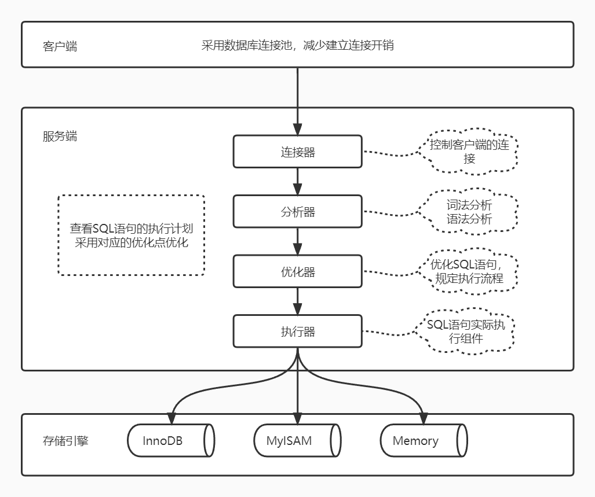
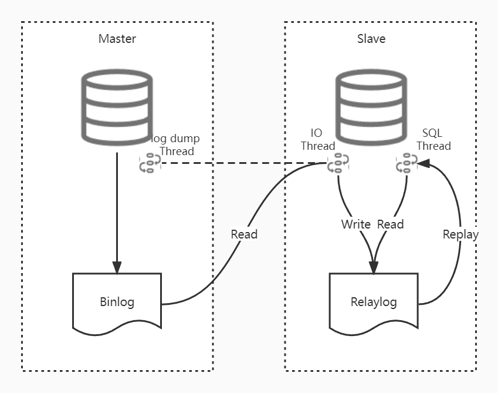
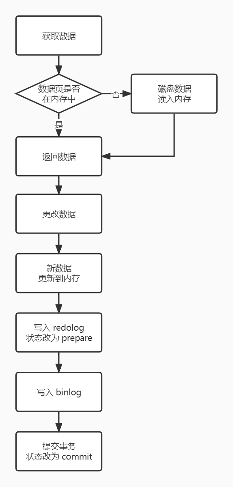
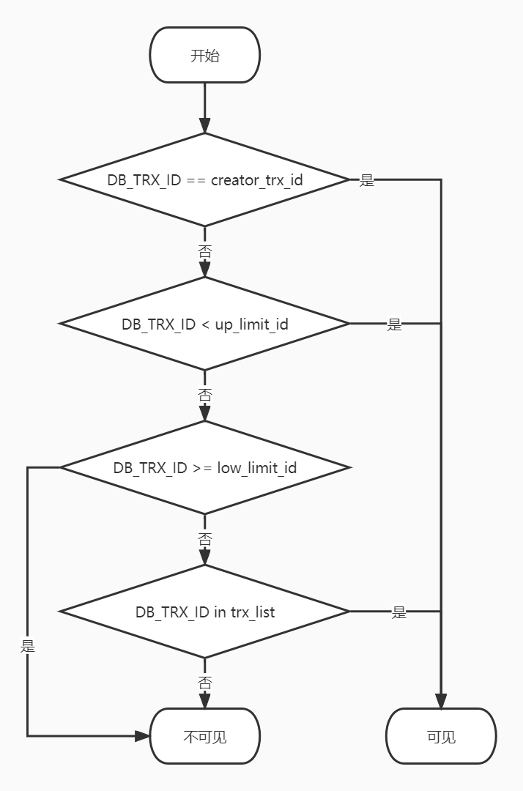
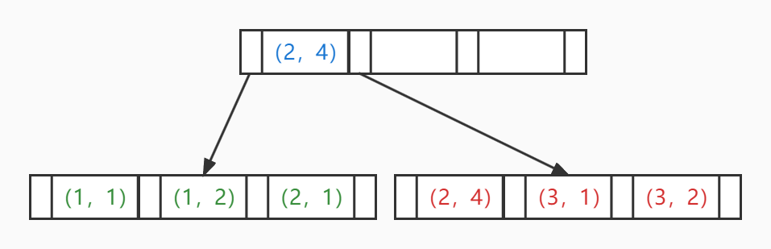

# MySQL

[TOC]

## 1. 架构

### 1.1 MySQL 架构图



### 1.2 主从复制



1.  从库通过命令 change master to 链接主库，获取主库的 binlog 信息（file_name, position）
2.  从库的 IO 线程与主库的 log dump 线程建立连接
3.  从库 IO 线程向主库发起同步请求
4.  主库 log dump 线程根据从库的同步请求，把本地的 binlog 以 events 的方式发送给从库的 IO 线程
5.  从库 IO 线程接收 binlog events，存入本地 relaylog 中
6.  从库 SQL 线程读取 relaylog，回放至本地数据库，并把回放过的数据记录到 relay-log.info 中

## 2. 相关概念

### 2.1 存储引擎

|          | InnoDB                       | MyIsam                   |
| -------- | ---------------------------- | ------------------------ |
| 锁级别   | 行锁，页锁，表锁             | 表锁                     |
| 外键     | 支持                         | 不支持                   |
| 自增属性 | 支持                         | 不支持                   |
| 事务     | 支持                         | 不支持                   |
| MVCC     | 支持                         | 不支持                   |
| 读效率   | 低                           | 高                       |
| 写效率   | 高                           | 低                       |
| 清空表   | 一行一行删除                 | 新建表                   |
| 适合场景 | OLTP，频繁修改，安全性要求高 | OLAP，查询及插入操作为主 |
| 其他     | 每次读取 16 KB               |                          |

### 2.2 事务

#### 2.2.1 特性

-   原子性
    -   一个事务中的操作要么全部成功，要么全部失败
    -   undo log，记录了需要回滚的日志信息

-   一致性
-   隔离性
    -   一个事务的修改在最终提交前，对其他事务是不可见的
    -   MVCC 来保证
-   持久性
    -   一个事务一旦提交，所做的修改是永久保存到数据库中的
    -   redo log 和内存，mysql 修改数据时会同时在内存和 redo log 中记录，已便于宕机时的恢复

#### 2.2.2 二阶段提交



#### 2.2.3 隔离级别

1.  RU（读未提交）

    -   所有的事务可以查询到其他事务未提交的执行结果
    -   很少使用
    -   产生脏读、不可重复读、幻读

2.  RC（读已提交）

    -   一个事务只能查询到其他事务已经提交的执行结果
    -   解决了脏读（原因：一个事务中的每次快照读都会生成一个新的 read view）
    -   产生了不可重复读、幻读

3.  RR（可重复读）

    -   在当前事务的多次查询中间，即使其他事务对当前记录提交了修改，也不会影响当前事务的多次查询结果保持一致（原因：一个事务对某条记录的第一次快照读生成 read view，当前事务中此后针对此记录的快照读都是使用同一个 read view）
    -   MySQL 默认的隔离级别
    -   解决了不可重复度（原因：即上所述）
    -   产生了幻读

4.  可串行化

    -   强制事务排序，使之不能互相冲突
    -   每个读的数据行上加锁
    -   可能导致大量的超时和锁竞争
    -   解决了幻读

5.  其他概念

    -   当前读
        -   INSERT、UPDATE、DELETE、SELECT LOCK IN SHARE MODE、SELECT FOR UPDATE
        -   读到的永远是记录的最新版本
        -   读取时为了保证其他事务不能修改当前记录，会对读取的记录进行加锁
    -   快照读
        -   不加锁的 SELECT 
        -   读到的可能是记录的历史版本
        -   目的是为了提高并发性能，基于MVCC
        -   在串行隔离级别中，快照都会退化为当前读
    -   脏读
        -   一个事务读到了其他事务未提交的数据
    -   不可重复读
        -   在一个事务两次查询中间进行 UPDATE并提交，两次结果不同
        -   一个事务的执行过程中，另一个事务修改并提交了当前事务正在读取的数据，造成多次读取结果不同
        -   查询的是同一个数据
    -   幻读
        -   事务 T1 批量对某一列值为 A 的数据修改
        -   同时事务 T2 插入了一条列值为A的记录并提交
        -   事务 T1 查看刚刚完成的修改结果，发现还有一条没被修改，而这条数据是 T2 事务提交的
        -   查询的是一批数据

6.  查看当前的隔离级别

    ```mysql
    -- 查看当前的隔离级别
    select @@transaction_isolation;
    ```

### 2.3 锁

#### 2.3.1 属性分类

-   共享锁（读锁，S锁）
    -   一个事务为数据加上共享锁后，其他事务只能对该数据加共享锁，不能加排他锁，直到所有的共享锁释放后才能加排他锁。
    -   目的：为了支持并发读，避免出现重复读。
-   排他锁（写锁，X锁）
    -   一个事务为数据加上排他锁后，其他事务不能对该数据加任务锁。
    -   目的：在数据修改时，不允许其他事务读写，避免出现脏数据和脏读。

#### 2.3.2 粒度分类

-   行级锁，会产生死锁
    -   普通行锁
        -   锁住的是某一行或某几行
        -   粒度小，加锁复杂，不易冲突，支持的并发度高
    -   记录锁
        -   精准命中条件是唯一索引
        -   锁住的是一行记录
        -   粒度小，加锁复杂，不易冲突，支持的并发度高
    -   间隙锁
        -   锁住的是表记录的间隙，防止其他事务在这个间隙进行 Insert 从而产生幻读，左开右闭原则
        -   RR隔离级别支持
    -   临键锁
    -   记录锁+间隙锁，即锁住一个左闭右闭的间隙，InnoDB 的行锁默认算法
    
-   页级锁，会产生死锁
    -   锁住的是相邻的一组记录
    -   为了折衷，介于行锁和表锁之间
-   表级锁，不会产生死锁
    -   锁住的是整个表，资源是一次性获取的，没有满足死锁的条件
    -   粒度大，加锁简单，容易冲突

#### 2.3.3 其他

| SQL                           | 行锁类型 | 说明                     |
| ----------------------------- | -------- | ------------------------ |
| INSERT                        | 排他锁   | 自动加锁                 |
| UPDATE                        | 排他锁   | 自动加锁                 |
| DELETE                        | 排他锁   | 自动加锁                 |
| SELECT                        | 不加锁   |                          |
| SELECT ... LOCK IN SHARE MODE | 共享锁   | 当 LOCK IN SHARE MODE 时 |
| SELECT ... FOR UPDATE         | 排他锁   | 当 FOR UPDATE 时         |

1.  查看锁情况

    ```mysql
    -- 设置打印锁的详细信息
    set global innodb_status_output_locks = 1; 
    commit;
    
    -- 查看当前锁情况
    show engine innodb status \G
    ```

### 2.4 MVCC

#### 2.4.1 概念

1.  数据库并发场景

    -   读读：显然， 不需要并发控制

    -   读写：有线程安全问题，可能会产生脏读、幻读、不可重复读
    -   写写：有线程安全问题，可能存在更新丢失

2.  概念
    -   多版本并发控制
    -   在不加锁的情况下处理读写冲突，提高数据库并发性能-
    -   即：读写冲突的无锁并发控制
3.  解决问题：
    -   快照读下的幻读问题
    -   当前读的幻读问题并不能解决
        -   RR隔离级别中，可以使用临键锁
        -   可串行化级别中，默认解决幻读

#### 2.4.2 原理

>   MCVV  实现原理主要依赖于：记录的三个隐藏字段、undolog、read view 来实现

-   隐藏字段

    -   DB_TRX_ID：6字节，最近修改当前记录的事务ID
    -   DB_ROLL_PTR：7字节，回滚指针，指向当前记录的上一个版本
    -   DB_ROW_ID：6字节，隐藏的主键

-   undolog

    -   回滚日志，在 INSERT、DELETE、UPDATE 时产生的日志，方便回滚
    -   INSERT 回滚日志，只在事务回滚的时候需要
    -   DELETE 和 UPDATE 回滚日志，除了在事务回滚时使用，在快照读的时候也需要

-   read view

    -   事务进行快照读时，对该记录生成一个 read view，以此为条件判断当前事务能够读到该记录的哪个版本
    -   几个属性
        -   trx_list：活跃事务ID列表，用来维护当前 read view 生成时刻系统正在活跃的所有事务的ID
        -   up_limit_id：活跃事务ID列表中的最小事务ID
        -   low_limit_id：当前 read view 生成时刻尚未分配的下一个事务ID
        -   creator_trx_id：生成当前 read view 的事务ID

#### 2.4.3 执行步骤



### 2.5 索引

#### 2.5.1 数据结构

-   B+树
    -   InnoDB 引擎，叶子节点直接存放记录数据
    -    MyIsam 引擎，叶子节点存放数据的地址
    -   适合排序等操作
-   Hash
    -   Memery 引擎
    -   InnoDB 引擎支持自适应 Hash 索引，用户不可设置
    -   每个健只能对应一个值，不支持范围查找和排序
    -   优势
        -   等值查询非常快
        -   键值唯一，一次 Hash 算法即可定位到数据
        -   键值不唯一，先定位键，再根据链表找到值
    -   劣势：
        -   哈希冲突，造成数据散列不均匀，产生大量线性查询，效率低
        -   不支持范围查询，Hash 计算后会打乱顺序且不连续
        -   需要大量的内存空间

#### 2.5.2 特性

-   优势
    -   提高数据的查询效率
-   劣势
    -   需要占用一定的物理空间
    -   会降低 INSERT、UPDATE、DELETE 的效率，在操作数据的同时，还要维护索引

#### 2.5.3 设计原则

-   索引字段占用空间越小越好
-   适合索引的列是出现在 WHERE 语句中的列，或 JOIN 语句中的列
-   作为外键的数据列最好建立索引
-   数据量小的表，不必要建索引
-   索引列越少越好
-   尽量扩展索引，而不是建新的索引
-   不要给每一个列都建索引
-   不要给更新频繁的列建索引
-   不要给大文本、大对象建索引，如 text、image 等数据类型

#### 2.5.4 类型

-   普通索引
    -   允许被索引的列包含重复值
-   唯一索引
    -   被索引的列只能是唯一值，允许空值
-   主键索引
    -   特殊的唯一索引，不允许空值
    -   一张表只能有一个主键索引，一个主键索引可以有多个列
-   联合索引
    -   索引可以覆盖多个列
-   全文索引（倒排索引）

-   聚簇索引
    -   和数据放在一起的索引
    -   InnoDB 引擎中，在数据插入时，数据必须要与索引放在一起：
        -   有主键就使用主键，否则使用唯一索引，否则使用6字节的 RowID
        -   找到索引，也就找到了数据
    -   优势
        -   查找索引可以直接获取数据，效率高
        -   适用范围查询，因为数据是按照大小排列的
        -   适用排序查询，原因同上
    -   劣势
        -   索引维护代价大
        -   当使用 UUID 作为主键时，数据存储会稀疏，进而导致可能会比全表扫描更慢，所以一般建议使用 auto_increment 作为主键
-   非聚簇索引
    -   和数据不放在一起的索引
    -   MyIsam 引擎中，一定是非聚簇索引
    -   InnoDB 引擎中：
        -   B+树的叶子节点存储的是数据行地址
        -   找到索引，根据数据行的地址再去磁盘中找数据

#### 2.5.5 回表

-   根据普通索引查询到叶子节点的中的聚簇索引的 ID 值，再根据聚簇索引的 ID 值在聚簇索引中查询到所在行的整个记录，这种现象叫做回表
-   显然，需要回表的都是普通索引

#### 2.5.6 索引覆盖

-   根据普通索引查询到聚簇索引的 Key 值，和普通索引的索引列的值，直接返回结果，不需要其他列值，这种现象叫做索引覆盖

#### 2.5.7 索引下推

-   MySQL 5.6 新特性
    -   之前（非下推）：使用联合索引时，存储引擎层根据 Where 条件的第一列在 B+ 树的叶子节点找到主键 ID 后，通过回表操作，找到对应的记录，直接返回给 Server 层，由 Server 层去过滤 Where 之后的条件
    -   之后（下推）：使用联合索引时，存储引擎层根据 Where 条件的第一列在 B+ 树的叶子节点找到主键 ID 后，再继续根据第二列、第三列。。。依次查找，直到根据所有的 Where 条件定位到主键ID，此时再回表，找到对应的记录，返回给 Server 层
-   显然，”下推” 即是把原来 Server 层需要做的操作下放到存储引擎，借助索引来操作

#### 2.5.7 最左匹配

-   针对联合索引

-   Where 条件中从左边为起点，任何连续的条件都能与索引匹配上，同时遇到范围查询（> < like between）就会停止匹配

    ```shell
    # 例子
    索引：（a,b,c）
    
    # select *
    # 而当 select 的列全都在索引中时，无论怎样查询都会用到索引
    # - select (a,b,c) from TABC where c = ? 是可以用用到索引的
    
    # where
    1. a = ? and b = ? and c = ? # 用到索引
    2. c = ? and a = ? and b = ? # 用到索引，优化器自动调整顺序
    3. a = ? and b = ? # 用到索引
    4. a = ? and c = ? # 用不到索引
    5. a = ? and b = ? and c > ? # 用到索引
    6. a = ? and b > ? and c = ? # 用不到索引
    7. c = ? # 用不到索引，当 create table TABC_1 (id int primary key, a int, b int, c int, d int) 
    8. c = ? # 用到索引，当 create table TABC_2 (id int primary key, a int, b int, c int)
    # 当表中的所有列全都是索引列的时候，无论怎样查询都会用到索引
    
    9. a like 'test%'; # 用到索引
    10.a like '%test'; # 用不到索引
    
    11.a = '12345' # 用到索引，当 a varchar()
    12.a = 12345 # 用不到索引，当 a varchar() 隐式类型转换会使索引失效
    ```


-   原理

    

    -   由上图可见，第一列是有序的，而其余的列是无序的，所以当 Where 条件中跳过索引中左边的列时，没有办法用到索引，如语句6 用不到索引
    -   由上图可见，虽然除第一列之外其余列是无序的，但是当所有左边的列确定时，当前列是有序的，如语句5 可用到索引

### 2.6 慢查询

#### 2.6.1 处理

1.  开启慢查询日志，定位到出问题的 SQL 语句
2.  分析 SQL 语句，是否加载了额外的数据：
    -   查询了多余的行
    -   加载了不需要的列
3.  分析 SQL 语句的执行计划，然后获得其使用索引的情况，修改语句或索引，使 SQL 语句尽可能命中索引
4.  表的数据量是否过大，横向或纵向分表

### 2.7 MRR

> Multi-Range Read Optimization
>
> 即 MRR 通过把随机磁盘读转化为顺序磁盘读，从而提高了索引查询的性能
>
> 本质上是一种空间换时间的算法

1.  开启 MRR

    ```mysql
    set optimizer_switch = 'mrr=on';
    ```

2.  原理
    -   根据某个索引，定位到满足条件的多条记录，把这些记录的 ID 值放入 read_rnd_buffer 中
    -   把 read_rnd_buffer 中的 ID 进行排序（随机磁盘读转化为顺序磁盘读）
    -   排序后的 ID 数组，依次到主键 ID 索引中查询记录，并作为结果返回

### 2.8 FIC

> Fast Index Creation

1.  未使用FIC
    -   先创建一个临时表，把新数据和旧数据导入到临时表
    -   删除原始表
    -   把临时表改名为原始表
2.  使用FIC
    -   给当前表添加 S 锁
    -   显然，读操作没有问题，但是 DML 操作会出问题，

## 3. 优化

>   预先考虑：表字段的设计、合适的索引设计等
>
>   事后调优：性能监控、SQL 语句的调整、参数的设置、索引的创建和维护、架构的调整等

### 3.1 性能监控

#### 3.1.1 show profile

```mysql
-- 打开 show profile 开关
set profiling = 1;

-- 执行 SQL 语句

show profiles; -- 列出执行的所有的 SQL 语句
show profile; -- 打开最近一条执行的 SQL 语句的分析详情
show profile for query ${QUERY_ID}; -- 打开指定 query_id 的 SQL 语句的基本分析详情
show profile all for query ${QUERY_ID}; -- 显示所有新能信息
show profile block io for query ${QUERY_ID}; -- 显示块 IO 操作的次数
show profile context switches for query ${QUERY_ID}; -- 显示上下文切换次数，被动和主动
show profile cpu for query ${QUERY_ID}; -- 显示 CPU 使用情况
show profile ipc for query ${QUERY_ID}; -- 显示发送和接收的消息数量
show profile page faults for query ${QUERY_ID}; -- 显示页错误数量
show profile source for query ${QUERY_ID}; -- 显示源码中的函数名称与位置
show profile swaps for query ${QUERY_ID}; -- 显示 swap 的次数
```

#### 3.1.2 performance schema

1.  介绍

    -   提供了一种在数据库运行时实时检查 Server 的内部执行情况的方法。Performance Schema 数据库中的表使用 Performance Schema 存储引擎，该数据库主要关注 Server 运行过程中的性能相关的数据（Information Schema 主要关注 Server 运行过程中的元数据信息） 
    -   Performance Sechma 存储引擎使用 Server 源码中的“检测点”来实现事件数据的采集，没有单独的线程来实现整个机制。
    -   Performance Schema 通过监视 Server 的事件来实现监视 Server 内部运行情况，“事件”就是 Server 内部活动中所做的任何事情以及对应的事件消耗，利用这些信息来判断 Server 中的相关资源消耗在了什么地方。一般来说，事件可以是函数调用、操作系统等待、SQL 语句执行的阶段、整个 SQL 语句与 SQL 语句集合 等。事件的采集可以方便的提供 Server 中的相关存储引擎对磁盘文件、表 I/O、表锁等资源的同步调用信息。
    -   Performance Schema 中的事件记录的是 Server 执行某些活动对某些资源的消耗、耗时、执行次数等情况
    -   Performance Schema 中的事件只记录在本地 Server 的 Performance Schema 库中，事件数据不会持久化存储在磁盘中中，而是保存在内存，事件数据发送变化时不会被写入 Binlog 中，也不会通过复制机制被复制到其他 Server 中

2.  简单配置

    >   MySQL 5.7 版本中，默认是开启的，如果要关闭，必须修改配置文件

    ```mysql
    -- 查看开启状态
    show variables like 'performance_schema';
    
    -- 打开等待事件的采集器配置开关
    update setup_instruments set ENABLED = 'YES', TIMED = 'YES' where name like '%wait%';
    
    -- 打开等待事件的保存配置开关
    update setup_consumers set ENABLED = 'YES' where name like '%wait%';
    ```

3.  表的分类

    >   Perfomance Schema 库下的表可以按照监视不同的维度进行分组

    ```mysql
    -- 语句事件记录表
    show tables like '%statement%';
    
    -- 等待事件记录表
    show tables like '%wait%';
    
    -- 阶段事件记录表，记录语句执行的阶段事件
    show tables like '%stage%';
    
    -- 事务事件记录表，记录事务相关的事件
    show tables like '%transaction%';
    
    -- 监视文件系统层的调用
    show tables like '%file%';
    
    -- 监视内存使用
    show tables like '%memory%';
    
    -- 动态对 Performance Schema 进行配置的表
    show tables like '%setup%';
    ```

    

#### 3.1.3 show processlist

>   查看连接的线程个数，判断是否有大量线程处于不正常的状态或者特征

```mysql
show processlist;
-- id: session id
-- user: 连接的用户
-- host: 客户端地址
-- db: 操作的数据库
-- command: 命令类型
-- info: 执行的 SQL 语句
-- time: 命令执行耗费时间
-- state: 命令执行状态
```

### 3.2 Schema 与数据类型优化

#### 3.2.1 数据类型的优化

-   更小的通常更好
-   更简单
-   尽量避免 NULL

#### 3.2.2 合理使用范式和反范式

#### 3.2.3 主键的选择

#### 3.2.4 字符集的选择

#### 3.2.5 存储引擎的选择

#### 3.2.6 适当的数据冗余

#### 3.2.7 适当的拆分

### 3.3 执行计划优化

#### 3.3.1 执行计划中包含的信息

1.  id

    SQL 语句的序号

2.  select type

    查询的类型：普通查询、联合查询、子查询等

3.  table

    -   表明，或别名，可能是临时表或者 union 合并结果集

4.  type（效率从上到下依次降低）

    -   system 只有一行记录，const 的特例，一般不会出现
    -   const 最多有一个匹配行
    -   eq_ref 使用唯一索引进行数据查找
    -   ref 使用了非唯一索引进行查找
    -   ref_or_null 对某个字段既需要关联条件，也需要 null 值的情况下，查询优化器会选择这种方式
    -   index_merge 在查询过程中需要多个索引组合使用
    -   unique_subquery 利用唯一索引来关联子查询
    -   index_subquery 利用索引来关联子查询
    -   range 利用索引查询时限制了范围，避免了 index 的全索引扫描
    -   index 全索引扫描
    -   all 全表扫描

5.  possible_keys

    -   可能应用在这张表中的索引，一个或多个，但不一定被实际使用

6.  key

    -   实际使用的索引，如果为 NULL ，则表示没有使用索引
    -   如果使用了覆盖索引，则该值与查询的 select 字段相同

7.  key_len

    -   索引中使用的字节数，长度越短越好

8.  ref
    
    -   显示索引的哪一列被使用了
    
9.  rows
    -   根据表的统计信息及索引使用情况，大致估算找出所需记录需要读取的行数
    -   直接反应扫描了多少数据，在完成目标的情况越少越好
    
10.  filtered

     -   返回的结果行数占需要读到的行数的百分比，数值越大说明越准确

11.  extra

     -   using filesort: 对结果集使用了外部排序，不能通过索引顺序达到排序效果，CPU 消耗大，延时高，建议优化
     -   using index: 覆盖索引扫描，表示在索引树中就可以查找到所需的数据，不需要扫描表，效率较高
     -   using temporary: 使用了临时表，一般用于排序、分组、join 的情况，查询效率不高，建议优化
     -   using where: 使用了 where 过滤，效率较高

### 3.4 索引优化

#### 3.4.1 索引监控

```mysql
-- 命令
show status like 'Handler_read%';

-- 解释
-- Handler_read_first: 读取索引第一个条目的次数
-- Handler_read_key: 通过索引获取数据的次数
-- Handler_read_last: 读取索引最后一个条目的次数
-- Handler_read_next: 通过索引读取下一条数据的次数
-- Handler_read_prev: 通过索引读取上一条数据的次数
-- Handler_read_rnd: 从固定位置读取数据的次数
-- Handler_read_rnd_next: 从数据节点读取下一条数据的次数
```

#### 3.4.2 索引优化

1.  使用索引列进行查询时，尽量不要使用表达式，把计算放在业务层，而不是数据库层

2.  尽量使用主键查询，而不是其他索引，主键查询不会触发回表

3.  使用前缀索引

    -   使用某一列开始的部分字符串作为索引列，而不是列的全部

    -   当对应 BLOB、TEXT、VARCHAR 类型的列时，使用前缀索引可以节约索引空间，提高索引效率
    -   但是会降低索引的选择性
    -   索引的选择性越高，查询效率越高

4.  使用索引扫描来排序

5.  union all、in、or 都能使用索引，但推荐使用in

6.  范围列可用到索引，但是后面的列无法用到索引

7.  强制类型转换会导致索引失效

8.  更新频繁、数据区分度不高的字段不宜建索引

    -   更新会变更 B+树，在更新频繁的字段上建索引会降低数据库性能
    -   区分度 80% 以上就可以建索引，区分度的计算 count(distinct(列)) / count(*)

9.  创建索引的列不允许为 NULL 

10.  尽量使用 limit

11.  组合索引不要覆盖太多的列
