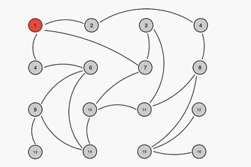
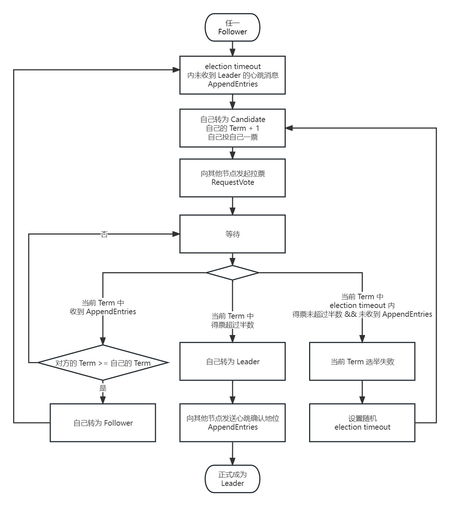

# Protocal

[TOC]

## 1. Gossip

>   最终一致性分布式共识协议
>
>   但实质是消息传播协议

### 1.1 原理

#### 1.1.1 六度分隔理论

-   你和任何一个陌生人之间的所间隔的人不超过五个，即最多通过五个人，你就能认识任何一个陌生人
-   1967年，哈佛大学心理学教授 Stanley Milgram 提出

#### 1.1.2 协议原理

1.  Gossip 周期性的传播消息
2.  初始节点随机选择 K 个相邻节点进行传播消息
3.  每次传播消息都选择尚未传播过的节点进行
4.  接收节点不再向发送节点传播，即无需回路

### 1.2 类型

#### 1.2.1 Anti-Entropy

>   反熵，以固定的概率传播所有的数据

-   每个节点（==I==nfective）周期性的随机选择其他相邻节点（==S==usceptible ），然后通过互相交换自己的==所有数据==来消除两者之间的差异
-   可靠，但每次节点需要两两交换，网络通信压力大

#### 1.2.2 Rumor-Mongering

>   谣言传播，仅传播新到达的数据

-   每个节点（==I==nfective）周期性的随机选择其他相邻节点（==S==usceptible ），然后向其发送自己的==新数据==，直到所有的节点都同步
-   当某个节点已经收到更新数据，并且不会再向其他节点进行传播，此时该节点状态变为（==R==emoved）

-   显然，会有概率使得更新的数据不会到达所有的节点

### 1.3 方式

#### 1.3.1 Push

1.  发送节点把消息（key, value, version）发送给接收节点

2.  接收节点更新自己的数据

#### 1.3.2 Pull

1.  发送节点把消息（key, version）发送给接收节点

2.  接收节点把自己的数据（key, value, version）返回给发送节点
3.  发送节点更新自己的数据

#### 1.3.3 Push+Pull

1.  发送节点把消息（key, value, version）发送给接收节点
2.  接收节点更新自己的数据，并把自己的数据（key, value, version）返回给发送节点
3.  发送节点更新自己的数据

### 1.4  特点

#### 1.4.1 优点

-   协议简单
-   扩展性：任何节点都可以随时加入或退出，不会影响整个网络内消息的传播
-   容错性：任何节点的崩溃和重启都不会影响整个网络内消息的传播
-   去中心化：每个节点的角色对等，任何一个节点都可以把消息扩散到整个网络
-   传播速度快：一般只需要 $O(logN）$轮即可传播完毕，而与集群规模无关

#### 1.4.2 缺点

-   最终一致性：消息传播的延迟，只能保证最终一致性，不能保证强一致性
-   网络压力大：无法避免重复传播到同一个节点的情况
-   拜占庭问题：如果存在恶意传播节点，则整个系统会出问题

### 1.5 应用场景

-   Consul
-   Redis Cluster
-   Akka Cluster
-   Cassandra
-   AWS S3
-   比特币

## 2. Raft

角色

-   Leader：一个集群只有一个 Leader，负责和客户端进行交互，负责向其他节点复制日志
-   Follower：稳定状态下，除 Leader 之外的其他节点都是 Follower

-   Candidate：选举状态下，Follower 转为 Candidate，上位成功的 Candidate 转为 Leader

消息

-   RequestVote：Candidate 发起
    -   拉取选票
-   AppendEntries：Leader 发起，
    -   发送心跳
    -   日志复制
    -   日志对齐

其他

-   Term：使用连续递增的编号，每一次新的选举，任期都会递增

-   日志格式：
    -   编号
    -   Term
    -   操作

Leader 选举

-   原则

    -   每一个成员每个 Term 内只有一张选票

    -   Candidate 的选票总是投给自己

    -   Term 大的 Follower 拒绝投票给 Term 小的拉取请求

    -   最后一条日志项编号（uncommited）大的拒绝投票给最后一条日志项编号（uncommited）小的

    -   Leader 收到 AppendEntries 消息时

        -   该 Leader 是前 Leader，下线后又恢复，所以保持自己下线前的 Leader 角色
        -   该集群网络发生隔离，？？？？？？？
        -   对比自己的 Term 和消息中的 Term，显然，这种情况下自己的 Term 比消息中的 Term 小，则自己转为 Follower

        

日志复制

-   异常情况
    -   重新选举
    -   脑裂