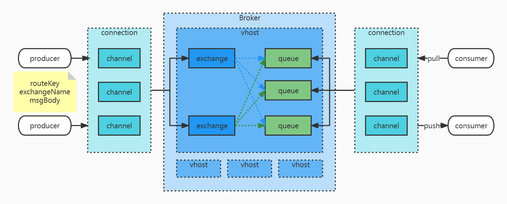
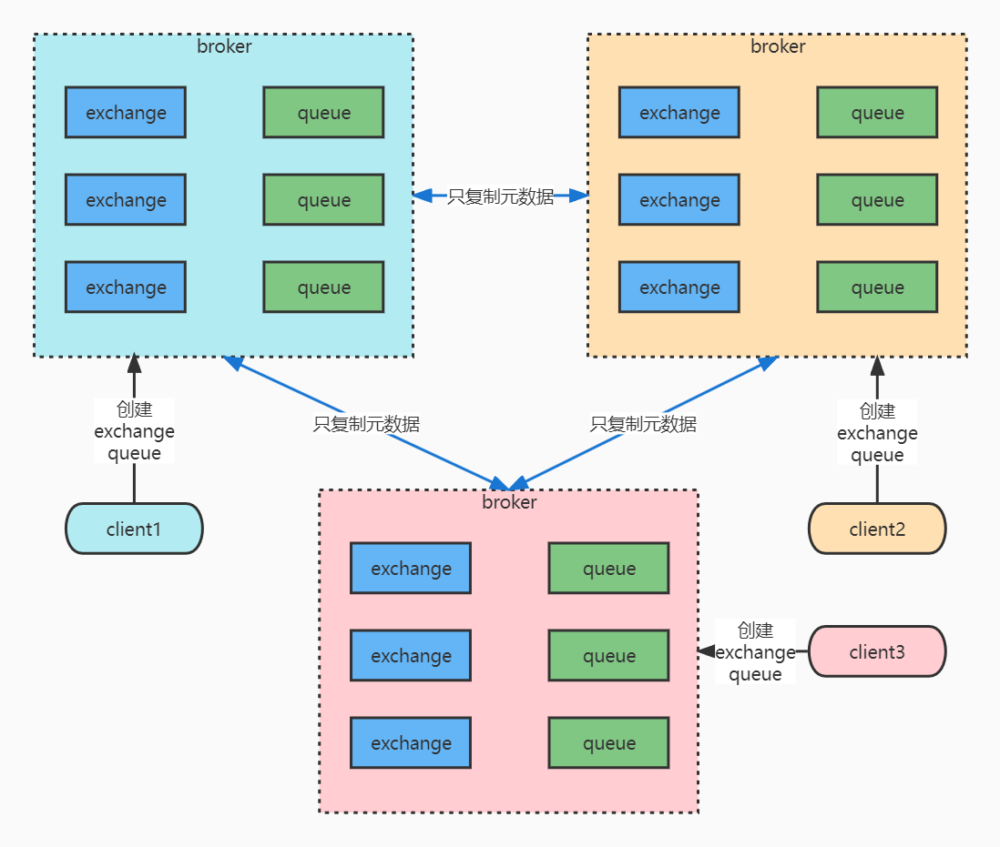
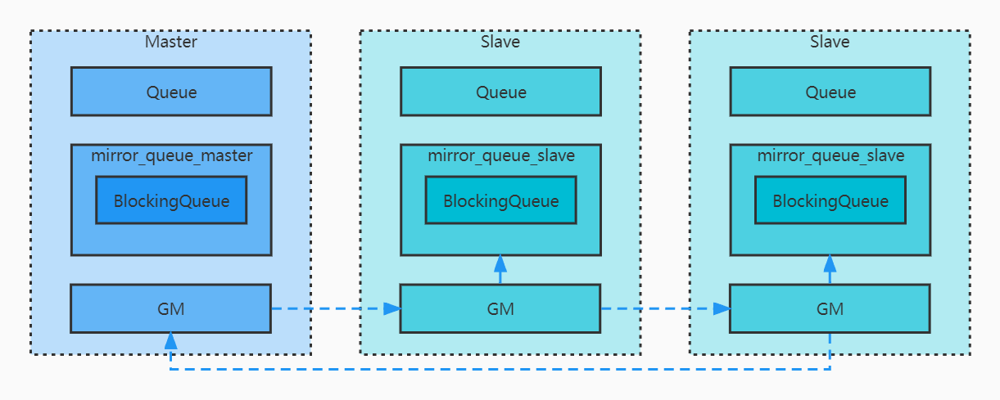
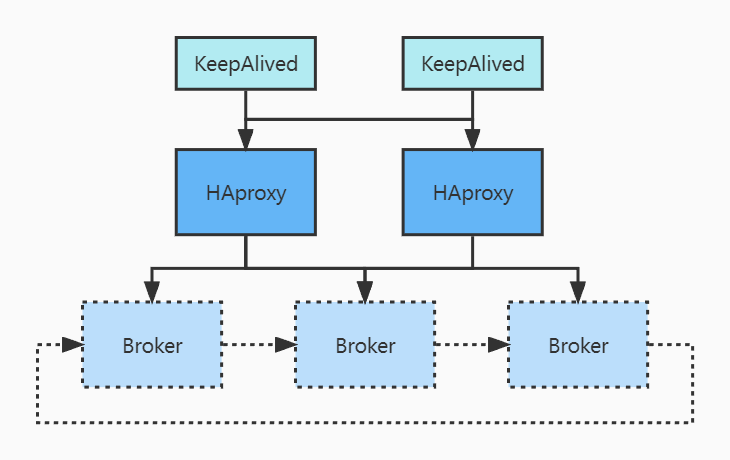

# RabbitMQ

[TOC]

## 1. 架构

### 1.1 RabbitMQ 架构图



-   connection：建立的一个 TCP 连接
-   channel：信道，是建立在 connection 上的虚拟连接，用于服用TCP连接，提高网络通道利用率
-   broker：RabbitMQ 的服务节点
-   vhost：类似于 namespace 的概念，用于隔离多租户
-   exchange：交换器，用于把消息路由到指定的队列中
-   queue：队列，用于在内存中存储消息，
-   bindingKey：关联 key，用于把 exchange 和 queue 关联起来，关联关系是多对多
-   routingKey：路由key，用于发送消息时在 exchange 上执行路由规则，当 routingKey 匹配到 bindingKey 时，就会把消息路由到关联的 queue

## 2. 相关观念

### 2.1 exchange

#### 2.1.1 类型

-   fanout：扇形交换器
    -   不论 routingKey 设置为何值，exchange 会直接把消息投递到所有绑定的 queue 中
-   direct：直接交换器
    -   exchange 只会把消息投递到与 routingKey 完全匹配的 bindingKey 绑定的 queue 中
-   topic：主题交换器
    -   routingKey 按照 topic 规则与 bindingKey 进行匹配
    -   bindingKey 以 . 分割不同的部分，* 匹配任一一个分割部分，# 匹配任意多个分割部分
-   header：键值交换器
    -   bindingKey 作为键值对的形式，匹配时需要先解开消息体中的 header 与 bindingKey 进行匹配，效率较低，很少使用

#### 2.1.2 备用和死信

-   备用 exchange：如果原 exchange 无法路由消息，可以设置一个备用 exchange，用来接收无法路由的消息。消息在 exchange 不能正常投递到 queue，偏生产端。

-   死信 exchange：专门用于把死信消息投递到死信队列中。消息已经进入了 queue，但由于队满、拒绝、过期等原因而被转为死信消息，偏向与消费端。

### 2.2 queue

#### 2.2.1 类型

-   临时队列
    -   自动删除队列：当没有消费者连接到该队列时，会自动删除
    -   单消费者队列：由一个消费者独占这个队列
    -   自动过期队列：当队列没有取消息操作，或没有消费者连接到该队列时，T时间后，删除队列。不会考虑是否还有消息被投递到该队列。
    -   创建队列时不指定队列名，会分配一个随机名称，由于是随机队列名，可以实现广播机制。
-   持久化队列
    -   队列的信息持久化到磁盘，性能较低，一般很少使用
-   死信队列
    -   死信消息，满足下列任一条件的消息，即为死信消息：
        -   消息在消费端被否认，即被 Nack 或 Reject，且 requeue == false
        -   消息在队列中的存活时间超过了设置的 TTL，TTL 可以在消息属性中设置，也可以在队列属性中设置
        -   队列已满的情况下，仍然有消息被投递到该队列，此时会把队头的消息挤出，即仍然遵循 FIFO
    -   申请的一个专门用于存放这些死信消息的队列，即可称为死信队列，并没有其他特殊的属性设置，仅在用途上归类
    -   DLX 死信交换器，专门用于把死信消息投递到死信队列中
    -   如果未配置 DLX，死信消息会被丢弃
-   延迟队列
    -   延迟消息：消息被投递后，希望消费端在一定时间之后再进行消费，这种消息一般成为延迟消息
    -   延迟队列的实现方式：
        -   TTL + DLX + 死信队列，消费端绑定死信队列，即可实现延迟队列
        -   rabbitmq-delayed-message-exchange 插件


### 2.3 消息

#### 2.3.1 消息的属性

-   content-type：消息体的 MIME 类型，如 application/json 等
-   content-encoding：消息体的编码类型，如是否压缩等
-   message-id：消息的唯一标识
-   correlation-id：关联消息的唯一标识，一般用于消息的响应，标识针对哪一条消息的响应
-   timestamp：消息创建时刻的时间戳，精确到秒
-   expiration：消息过期时刻的时间戳，精确到秒
-   delivery-mode：持久化标志，1-非持久化，2-持久化
-   user-id：标识已登陆用户，很少使用
-   app-id：应用程序的类型或版本号，由应用程序自由控制
-   type：消息类型，由应用程序自由控制
-   headers：键值对，由应用程序自由控制
-   priority：消息的优先级，会破坏消息的顺序性
-   reply-to：用来实现 request-response 模式，类似于 RPC 调用

#### 2.3.2 消息的生产

-   备用 exchange：如果原 exchange 无法路由消息，可以设置一个备用 exchange，用来接收无法路由的消息

#### 2.3.3 消息的投递

-   由 exchange 的类型、bindingkey 和 routingKey 的匹配来确定消息的投递
-   如果设置了 requeue 为 true，当消息被消费端 Nack 或 Reject 时，消息会被重新投递给绑定了当前队列的其他消费端
-   如果设置了 requeue 为 false，当消息被消费端 Nack 或 Reject 时，消息会被重新投递到 DLX，如果没有设置 DLX，则会被丢弃

#### 2.3.4 消息的消费

-   多个消费端绑定同一个 queue 时，会轮询消费
-   广播机制
    -   可以 exchange 绑定多个 queue，多个消费者分别绑定每一个 queue
    -   可以使用临时队列，临时队列的名称完全随机，所以相当于每个消费者都绑定到不同的 queue 上
-   消费端一般使用 push 模式
-   批量确认机制可以极大提升性能
-   事务机制一般不使用
-   单队列模式一般用于保证消息的顺序性，但是显然会牺牲消息的处理速度

### 2.4 消息的顺序性

#### 2.4.1 生产端

-   exchange 只绑定一个 queue

#### 2.4.2 消费端

-   queue 只绑定一个 一个消费端

### 2.5 消息可靠性

>   消息的可靠性用来保证消息不丢失
>
>   RabbitMQ 消息的可靠性一般有两种机制：消息的事务机制和确认机制。其中事务机制对性能影响较大，一般较少使用

#### 2.5.1 消息事务机制

-   原理

    -   在提交事务之前，消息其实是放在临时队列中，只有在提交事务之后，才会把消息从临时队列投递到真正的消费队列中

-   生产端

    ```java
    channel.txSelect(); // 通知 broker 开启事务模式
    channel.basicPublish(); // 发送消息
    channel.txCommit(); // 提交事务
    channel.txRollback(); // 回滚事务
    ```

-   消费端

    -   autoAck 设置为 false，关闭自动确认，改为手动确认
    -   如果设置了手动确认，但一直没有进行 Ack 或 Nack 的应答，就会一直阻塞

#### 2.5.2 消息确认机制

-   生产端确认
    -   把 channel 设置为 confirm 模式，所有在 channel 上的消息都会被分配一个唯一的ID
    -   broker 会给生产端发送一个确认，正确投递到队列时为 Ack，由于内部错误不能正常投递到队列时为 Nack
    -   每一条消息都会被 Ack 或 Nack 一次
    -   confirm的三种模式：
        -   普通模式
        -   批量模式
        -   异步模式
-   消息持久化，一般所有的持久化都会牺牲性能
    -   交换机持久化
    -   队列持久化
    -   消息持久化
-   消费端确认
    -   设置 noack 为 false，关闭自动提交
    -   broker 会等待消费端显示返回 ack 之后，再从内存或磁盘中把消息删除
    -   broker 等待 ack 不会超时，会一直等待，来确保消息的最终一致性
    -   如果消费端在返回 ack 之前断开了连接，broker 会重新把消息投递到下一个订阅的消费者，显然这样会造成重复消费，一条消息被两个消费者消费，需要有去重保障：唯一标识、偏移量、序号大小等。


## 3. 集群和高可用

### 3.1 普通集群模式



-   只同步元数据，不同步消息，所以不能实现高可用
    -   基于性能考虑
    -   基于存储考虑
-   元数据：
    -   vhost 元数据：vhost 内的 exchange、queue、binding 的命名空间和安全属性
    -   exchange 元数据：exchange 的名称、类型、属性
    -   queue 元数据：queue 的名称、属性
    -   binding 元数据：exchange 和 queue 的绑定关系
-   节点类型
    -   磁盘节点：配置信息和元数据存储在磁盘上
    -   内存节点：配置信息和元数据存储在内存中。显然性能高，但是不能持久化。
-   客户端（包括生产端和消费端）连接的节点上没有期望的 queue 中的数据时，会由节点进行路由转发
-   普通集群模式要求至少有一个磁盘节点，当有其他节点加入或推出集群时，必须通知磁盘节点
-   如果普通集群中没有磁盘节点，消息的生产和消费可以正常进行，但是集群的更新无法进行，因此一般建议普通集群模式中至少保有两个磁盘节点

### 3.2 镜像队列模式



-   可实现高可用
-   概念
    -   Queue：负责 AMQP 协议的实现，以及消息的 commit、rollback、confirm 等
    -   mirror_queue_master/slave：负责消息的处理
        -   BlockingQueue：真正存放消息的队列
    -   GM：负责节点之间的消息同步，所有的 GM 链成 gm_group 循环链表
-   原理
    -   当 master 收到消息时，由 master 的 GM 把消息通过 gm_group 链表发送给其他 GM，当 gm_master 收到该消息时，显然表示整个 gm_group链表中都同步了消息
    -   当 slave 的 GM 同步到消息时，会写入到当前节点的 BlockingQueue 中
    -   当 master 失联时，会从 gm_group 中找到加入时间最长的 GM 所在的节点，提升为新的 master

### 3.3 三方组件模式



-   镜像队列模式的基础上引入 HAproxy 和 KeepAlived
