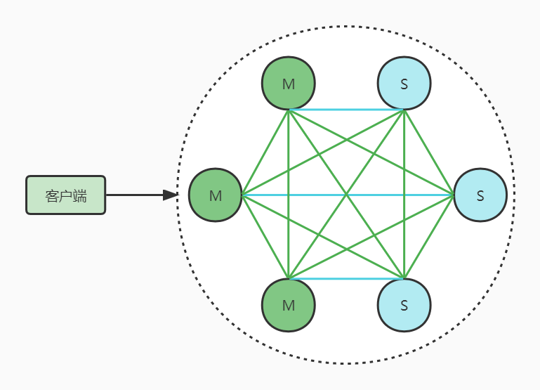

# Redis

[TOC]

## 1. 基本架构


### 1.1 访问模块

-   访问模式通常有两种：
    -   通过动态链接库调用的方式 
        -   RocksDB
    -   通过网络框架以Socket通信的方式 
        -   Redis
        -   Memcached

### 1.2 索引模块

-   索引的作用是让KV数据库根据Key找到相应的Value的存储位置，进而执行操作。
-   索引的类型有很多，Redis采用哈希表作为索引，因其数据基本都是保存在内存中，而内存的高性能随机访问特性可以很好的与哈希表O(1)的操作复杂度匹配。
-   Redis由于Value支持多种类型，当通过索引找到Key所对应的Value后，仍然需要从Value的复杂结构中进一步找到实际需要的数据

### 1.3 操作模块

-   索引模块定位之后，对于不同的操作，就需要操作模块来实现
-   如写入、删除键值对，分配、释放内存

### 1.4 存储模块

-   简单的使用glibc的分配器，在处理随机大小的内存分配时，表现不友好，一旦保存的数据规模过大，容易造成严重的内存碎片问题
-   Redis的内存分配器提供了多种选择
-   Redis的持久化功能

### 1.5 其他模块

-   除了以上基本模块，Redis中包含了集群功能的支撑模块，如高可用和高扩展模块等。


## 2. 数据结构

### 2.1 概述


```shell
# 查看一个 KEY 的数据结构类型
TYPE ${KEY}

# 查看一个 KEY 的底层数据结构类型
OBJECT ENCODING ${KEY}
```

-   使用全局 Hash 存储所有的 KV
-   使用渐进式 Rehash 解决 Hash 冲突问题，把 Rehash 分摊到每一个请求中
    -   Rehash 触发条件：
        -   原 Hash 中的 Key 数量超过 Hash 的容量
        -   当前没有子进程进行 AOF 或 RDB 的操作

### 2.2 String

#### 2.2.1 应用场景

-   简单分布式锁

    ```shell
    # 将 key 的值设为 value，当且仅当 key 不存在
    SETNX ${key} ${value}
    
    # 将值 value 关联到 key，并将 key 的生存时间设为 seconds
    SETEX ${key} ${second} ${value}
    ```

-   原子计数器

    ```shell
    # 自增一
    INCR ${key}

    # 将 key 所储存的值加上增量 increment
    INCRBY ${key} ${increment}
    ```
    

#### 2.2.3 内部编码

-   整型
    -   当 String 的 Value 类型为整型时，自动采用整型数据结构存储
-   embstr 字符串
    -   当 String 的 Value 类型不为整型、且长度小于等于 44 字节时，采用 embstr 字符串存储
    -   分配连续内存
-   raw 字符串
    -   当 String 的 Value 类型不为整型、且长度大于 44 字节时，采用 raw 字符串存储
    -   内存不连续


### 2.3 List

#### 2.3.1 应用场景

-   简单分布式栈、队列

#### 2.3.2 内部编码

-   双向链表 Linkedlist
-   压缩列表 Ziplist


### 2.4 Hash

#### 2.4.1 应用场景

-   需要保存不同属性的值

#### 2.4.2 内部编码

-   压缩列表 Ziplist

-   哈希表 Hashtable

-   相关配置

    ```shell
    # Key 的数量上限
    hash-max-ziplist-entries
    
    # 单 Key 的最大长度
    hash-max-ziplist-value
    ```

    -   超过任一个限制，Hash 底层会从压缩列表转为哈希表存储，过程不可逆

    -   显然，压缩列表更节省内存


### 2.5 Set

#### 2.5.1 应用场景

-   简单抽奖

    ```shell
    # 返回集合 key 中随机的 count 个元素
    SRANDMEMBER ${key} ${count}
    
    # 返回并移除集合 key 中随机的 count 元素
    SPOP ${key} ${count}
    ```

-   简单关注模型

    ```shell
    # 返回集合的交集，可用作取共同关注的人
    SINTER ${key1} ${key2} ${key3}
    
    # 返回集合 key1 减去 key2 的差集，可用作取可能想关注的人
    SDIFF ${key1} ${key2}
    
    # 判断集合 key 中是否包含 member
    SISMEMBER ${key} ${member}
    ```

#### 2.5.2 内部编码

-   整型数组集合 Intset
-   哈希表 hashtable


### 2.6 SortSet

#### 2.6.1 应用场景

-   可排序的集合

#### 2.6.2 内部编码

-   压缩列表 Ziplist

    

    -   使用连续的 entry 保存数据，节省内存
        -   prev_len：上一个 entry 的长度
        -   encoding：编码方式，1字节
        -   len：当前 entry 的长度，4字节
        -   content：实际数据
    -   查询时需要遍历整个压缩列表，属于牺牲时间换取空间

-   跳表 Skiplist

    
    
    -   在原有序链表的基础上，增加多个索引层，加快查找的效率


### 2.7 Bitmap

-   使用 Bit 位来记录数据：0 表示不存在，1 表示存在
-   节省内存空间

```shell
# 设置 key 的第 offset 位 bit 值为 0 或 1
SETBIT ${key} ${offset} ${0|1}

# 获取 key 的第 offset 位 bit 值
GETBIT ${key} ${offset}

# 获取 key 中被设置为 1 的比特位的数量
BITCOUNT ${key}
```

### 2.8 HyperLogLog

-   用来做基数统计，在元素的量级非常大时，计算基数所需的空间总是固定的、较小的
-   只是根据元素来计算基数，而不保存元素本身，所以不能通过 HyperLogLog 获取具体的元素

```shell
# 将任意数量的元素添加到指定的 key 里面
PFADD ${key} ${member1} ${member2} ${member1}

# 获取 key 的近似基数
PFCOUNT ${key}

# 获取 key1、key2、key3 的并集的近似基数
PFCOUNT ${key1} ${key2} ${key3}

# 将 key2、key3 合并为 key1，合并后的 key1 的基数近似于 key2、key3 的并集的基数
PFMERGE ${key1} ${key2} ${key3}
```

### 2.9 Geo

-   用于存储地理位置经纬度，并作相应的计算
-   底层是借助 SortSet 来实现的
-   GeoHash编码
    -   对经度或纬度的最大区间进行 N 次二分，记录真实数据在每次二分区间的位置：0 或 1，最后得到一个 N bit 位的数。其中自定义次数 N。
    -   分别对经度和纬度进行GeoHash编码后，对得到的两个N bit位的数字进行合并： 
        -   把经度编码值放在偶数 bit 位上
        -   把纬度编码值放在奇数 bit 位上

```shell 
# 按照 经度、纬度、名称 的顺序向 key 中添加多个位置元素
GEOADD ${key} ${longitude1} ${latitude1} ${member1} ${longitude2} ${latitude2} ${member2}

# 计算 key 中两个位置元素之间的距离
GEODIST ${key} ${member1} ${member2} ${unit}

# 获取 key 中指定位置元素的位置信息
GEOPOS ${key} ${member1} ${member2}
```

### 2.10 Stream

-   可认为是简化的内存版 Kafka

```shell
# * 是默认使用redis生成唯一消息ID，也可以自己生成填入这个位置，但要保证全局唯一
# 消息内容为key-value型数据
XADD ${stream_name} * ${msg_key1} ${msg_value1} ${msg_key2} ${msg_value2} ...

# num 读取个数，不指定则不限定读取个数
# sec 阻塞时间，如果指定阻塞模式，则需要把${msg_id}置为$
# msg_id 消息ID，从某个消息开始读取，如果为0，则表示读取所有
XREAD [ COUNT ${num} ] [BLOCK ${sec}] STREAM ${stream_name} ${msg_id}

# msg_id 消息ID，表示该消费组从${msg_id}消息开始读取，一般设置为0，表示从第一条消息开始读取
XGROUP CREATE ${stream_name} ${group_name} ${msg_id}

# num 读取个数，不指定则不限定读取个数，一般设定为1，方便在消费组内均衡消费者读取
# sec 阻塞时间
# > 表示从组内未被消费的消息开始读取
XREADGROUP ${group_name} ${consumer_name} [ COUNT ${num} ] [BLOCK ${sec}] >

# count 查看个数，不指定则不限个数
# consumer_name 消费者名称，不指定则组内所有消费者情况
XPENDING ${stream_name} ${group_name} [- + ${count} ${consumer_name} ]

XACK ${stream_name} ${group_name} ${msg_id}

# consumer_name 转移目标消费者
# idel_time 已读取未确认时长超过idel_time，才会被转义
# msg_id 需要被转移的消息ID
XCLAIM ${stream_name} ${group_name} ${consumer_name} ${idel_time} ${msg_id}

XDEL ${stream_name} ${msg_id}
```


## 3. 持久化

### 3.1 RDB

#### 3.1.1 原理

-   Redis DataBase，将某一时刻的内存快照，以二进制的方式写入磁盘
-   触发机制
    -   手动触发
        -   手动执行 save 命令，Redis 处于阻塞状态，直到 RDB 持久化完成
        -   手动执行 bgsave 命令，主进程 fork 一个子进程进行 RDB 持久化，主进程继续响应客户端请求
    -   自动触发
        -   配置 save ${second}  \${number}，如果在 \${sencond} 时间内有 \${number} 个 Key 发生变化，则触发 RDB 持久化
        -   执行 flushall 或 flushdb 命令，会清空 Redis 所有数据库或当前数据库的数据，以及已经存在的 RDB 文件，然后生成新的 RDB 文件
        -   主从同步，全量同步时主节点会自动触发 bgsave 命令，生产 RDB 文件发送给从节点
-   Copy On Write，写时拷贝，将子进程对父进程的内存拷贝推迟到写操作真正发生时，避免大量无意义的拷贝操作
    -   fork 之后
        -   父进程和子进程会被 Kernel 分配到不同的虚拟内存空间
        -   但是在刚开始，父进程和子进程的不同虚拟内存空间映射到相同的物理内存空间上
    -   只有当父进程或子进程对共享的内存进行修改时，共享的内容才会以 Page 为单位进行拷贝：
        -   父进程保留原物理内存空间
        -   子进程使用拷贝后新物理内存空间
    -   显然，在 Redis 中，子进程只会读取共享内存，只有父进程才会修改共享内存，所以只有父进程才会触发 COW
    -   另一方面，Redis 中写操作要原少于读操作，所以 COW 可以大大提高了 RDB 的效率，并节省内存

#### 3.1.2 优点

-   整个 Redis 数据库只包含一个 RDB 文件，方便持久化
-   性能最大化，由于是通过 fork 出来的子进程进行持久化，主进程继续处理客户端请求，保证了 Redis 的高性能
-   恢复时效率更高

#### 3.1.3 缺点

-   安全性低。如果在两次 RDB 之间发生故障，则数据丢失较严重

### 3.2 AOF

#### 3.2.1 原理

-   Append Only File，以日志的形式记录每一写命令

-   由主线程记录日志

-   写后日志，即先执行命令，再记录日志，避免了记录错误命令，且不会阻塞当前命令，但是有可能阻塞下一条命令

-   记录日志时先记录到 AOF 缓冲区，再向磁盘进行同步，写盘策略：

    -   Always，同步写盘，执行完命令立即写盘，最多丢一条
    -   Everysec，每秒写盘，每秒定期把 AOF 缓冲区的内容写入磁盘
    -   No，不主动写盘，由操作系统控制 AOF 缓冲区的写盘时机

-   AOF 重写

    

    -   结合 Redis 当前数据状态和 AOF 日志，把针对同一个 key 的多条命令合并成一条命令，忽略中间状态，最终只保存这个 key 的一条命令
    -   重写过程是由后台线程 bgrewriteaof 来实现的，不阻塞主线程

#### 3.2.2 优点

-   数据相对安全。

#### 3.2.3 缺点

-   某条命令执行后、记录日志之前发生故障，那么该条命令会丢失
-   AOF 文件一般要比 RDB 文件大，当 AOF 文件过大时会产生问题：
    -   追加日志内容时效率变低
    -   恢复效率低

### 3.3 结合使用

-   RDB 快照不必频繁生成，避免了 fork 操作对主线程的影响
-   AOF 日志不必过大，只需记录两次 RDB 快照之间的操作，避免了文件过大带来的影响，减少了 AOF 重写开销


## 4. 线程模型

### 4.1 单线程

-   Redis 的单线程，指的是网络 IO 和 KV 读写是由一个线程来完成的
-   Redis 的其他功能，如持久化、异步删除、集群数据同步等，是由其他的线程来完成的
-    优势

    -   避免了多线程中共享资源的并发访问控制带来的复杂问题
    -   避免了多线程中同步原语带来的代码调试性和可维护性的降低
    -   避免了线程切换的开销
    -   单线程使用非阻塞多路 IO 复用 epoll，增加网络请求处理的效率

### 4.2 多线程

-   Redis 的性能瓶颈主要在内存和网络 
    -   针对内存，需要物理增加
    -   针对网络，新版本Redis选择使用多线程方式处理网络 IO 的维护，且充分利用服务器多核性能
-   新版本 Redis 的多线程主要体现在处理网络 IO，KV 读写的真正执行还在主线程以单线程的方式顺序执行


## 5. 高可用

### 5.1 简单主从


#### 5.1.1 读写分离

-   对于读操作，主库和从库都可以执行
-   对于写操作，只能主库执行，然后同步给从库
-   主从级联：
    -   把主库生成 RDB 快照和传输 RDB 快照的压力，以级联的方式分摊到从库上
    -   避免了从库数量过多时，主库忙于 fork 子进程和传输 RDB 造成的资源占用

#### 5.1.2 主从复制


-   replication buffer
    -   master 节点维护，对应每个 slave
    -   slave 与 master 建立连接后，master 会创建一个对应的 replication buffer；slave 断开后，其对应的 replication buffer 会被 master 删除
-   <a name="复制积压缓冲区">replication backlog buffer</a>
    -   master 节点维护，所有 slave 共用
    -   master 所有写命令除了通过命令传播给 slave，还会写入环形缓冲区 replication backlog buffer
    -   增量复制时，master 可以根据 slave 的 psync 命令中的 offset 在环形缓冲区中定位到该 slave 缺少的写命令，然后进行这部分的增量复制
    -   由于是环形缓冲区，肯定会发生覆盖，显然如果 slave 的断开时间太长，缺少的命令数已经大于缓冲区的长度，此时会自动触发全量复制
    -   [返回](#back)

#### 5.1.3 优缺点

##### 5.1.3.1 优点

-   读写分离，一定程度上提高效率
-   每个节点都是完整的数据副本

##### 5.1.3.2 缺点

-   数据量非常大时，主从同步会影响主节点对外提供服务的性能

-   集群中所有的节点保存的都是全量数据，造成一定程度的资源浪费，并不是真正的分布式

-   不能自动进行故障转移，需要手动干预从节点提升为主节点

-   主从数据不一致

    -   原因：
        -   采用的异步复制，无法保证强一致性
    -   解决：
        -   保证良好的网络环境，尽量减少网络延迟
        -   自研程序监控从库的复制进度，一旦进度延迟超过阈值，则停止从库对外提供服务

-   从库读到过期数据

    -   原因：
        -   从库在同步时接收到主库设置了 TTL 的 Key，会在自己的时间上重新设置 TTL，这样从库上的 TTL 就会比主库上对应 Key 的 TTL 延后

    -   解决：
        -   设置 TTL 尽量使用 EXPIREAT、PEXPIREAT，设置过期时间点，而不是过期时间段

-   脑裂，主从集群中同时有两个主节点

    -   原因：

        -   主库假死，被判定为客观下线，降为从库，后一段时间恢复正常，仍然可以接收客户端请求

    -   解决：

        ```shell
        # 主库能进行数据同步的最小从库数量
        min-slave-to-write ${number}
        
        # 数据复制时，从库给主库发送 ACK 消息的最大延迟
        min-slave-max-log ${second}
        ```

        -   主库连接的从库中，至少要有 number 个从库在与主库进行数据复制的 ACK 延迟不超过 second 秒，否则该主库不再接收写请求

### 5.2 哨兵集群


#### 5.2.1 哨兵功能

##### 5.2.1.1 监控

-   哨兵使用 ping 命令，周期性检查所有节点的存活情况
-   如果 ping 响应超时，则标记对应节点为 ”主观下线“
    -   从节点，无影响
    -   主节点，当哨兵集群中半数以上的哨兵都标记该主节点为 ”主观下线“，即可认定为 ”客观下线“
-    Leader 选举，其实是执行者选举，选举出执行本次故障转移的执行者，本次故障转移结束该 Leader 的角色即失效
    -   任何一个哨兵只要自己判定主库为 ”主观下线“ 状态，即发起 Leader 选举投票
        -   投自己一票
        -   向其他哨兵发送 is-master-down-by-addr 命令，其他哨兵做出投票或拒绝的响应
    -   任何一个哨兵只有一票，即要么投票给自己，要么投票给第一个候选人
    -   每个哨兵不同的网络状况、随机时间偏移等，决定了一般不会存在哨兵同时发起投票的极端情况
    -   如果出现极端情况导致出现票数相同的候选人，哨兵集群会等待一段时间重新进行 Leader 选举

##### 5.2.1.2 选主


##### 5.2.1.3 通知

-   选择新主后，通知其他从库进行连接同步
-   选择新主后，把新主的信息通过 PUB/SUB 方式通知给客户端

#### 5.2.2 哨兵集群

##### 5.2.2.1 概述

-   多个哨兵的网络同时不稳定的概率较小，避免单哨兵因自身网络情况导致的误判，降低误判率
-   哨兵集群的个数
    -   最少 3 个
        -   3 个，是满足 Leader 选举的最小个数
        -   如果是 2 个，则半数以上的个数为 2，这样一旦有一个哨兵故障，则哨兵集群不可用 
    -   最好奇数
        -   这里讨论大于 3 的数字，半数以上的个数为 N / 2 + 1
        -   分析可知，相同的容错能力下，奇数个节点更节省资源
            -   N = 3 和 N = 4 时，都最多可允许 1 个哨兵节点故障
            -   N = 5 和 N = 6 时，都最多可允许 2 个哨兵节点故障

##### 5.2.2.2 组成哨兵集群


```shell
sentinel monitor ${master-name} ${master-ip} ${master-port} ${quorum}
```

1.  哨兵节点配置上述命令，与主节点建立连接
2.  哨兵节点在指定频道上 PUB 自己的地址和端口
3.  其他哨兵节点订阅该频道，可以 SUB 到当前哨兵节点的信息，并与当前哨兵节点建立连接
4.  每一个哨兵都会执行上述操作，于是建立哨兵集群

##### 5.2.2.3 监控主从集群


1.  每个哨兵定期向主节点发送 INFO 命令，获取所有的从节点信息
2.  哨兵获取从节点信息后，与所有的从节点建立建立，即可发送 ping 命令，对其进行监控

#### 5.2.3 优缺点

##### 5.2.3.1 优点

-   哨兵模式本质还是主从集群，只是引入哨兵来解决自动故障转移
-   主从集群本身的读写分离、数据的多副本保存

##### 5.2.3.2 缺点

-   数据量非常大时，主从同步会影响主节点对外提供服务的性能
-   集群中所有的节点保存的都是全量数据，造成一定程度的资源浪费，并不是真正的分布式
-   故障转移时，即哨兵进行重新选主的过程中，Redis 集群是无法对外提供服务的


### 5.3 分片

#### 5.3.1 基本原理



-   Redis Cluster 把全量的数据按照 16384 个 slot 进行分片，每个 master 节点负责一定范围的 slot，配置高的 master 节点可以多分配一些 slot
-   Redis Cluster 中仍然有 master 和 slave 角色的区分，master 负责提供读写，slave 对其进行数据复制，以提高单分片的可靠性
-   Redis Cluster 通过 Gossip 协议进行数据通信，这样把任一 master 的 slot 信息同步给其他 master

#### 5.3.2 Slot

-   slot 到 master 的映射

    -   自动分配，初始化 Redis Cluster 的时候，会自动把 16384 个 slot 平均分配到所有的 master 上
    -   手动分配，可以根据每个 master 的实际情况进行手动分配，更合理的利用资源

    ```shell
    # 把从 ${slot_id_begin} 到 ${slot_id_end} 的 slot 分配到指定的 master 节点上
    redis-cli -h ${redis_addr} -p ${redis_port} cluster addslots ${slot_id_begin},${slot_id_end}
    ```

-   key 到 slot 的映射

    ```shell
    CRC16(${hash_tag}) mod 16384
    ```

    -   随机映射，一般情况下 ${hash_tag} 为整个key 
    -   固定映射，当需要把某些 key 固定到某个 slot 时，可以使用 {}，如：key:user:{1024}，则会把 {} 中的内容作为 ${hash_tag} 计算 slot 

#### 5.3.3 集群操作

```shell
# 创建集群，并设置每个 master 的副本数为 1
redis-cli --cluster create ${redis_addr:redis_port} ${redis_addr:redis_port} ${redis_addr:redis_port} ${redis_addr:redis_port} ${redis_addr:redis_port} ${redis_addr:redis_port} --cluster-replicas 1

# 查看集群信息
redis-cli -h ${redis_addr_exist} -p ${redis_port_exist}
> cluster nodes

# 向集群中新增一个节点，默认为 master 角色，指定集群中任一节点作为推荐人
redis-cli --cluster add-node ${redis_addr_new:redis_port_new} ${redis_addr_exist:redis_port_exist}

# 重新分配 slot, 按提示进行重新分配即可
redis-cli --cluster reshard ${redis_addr_exist:redis_port_exist}

# 把新加入的节点设置为某个 master 的 slave
redis-cli -h ${redis_addr_new} -p ${redis_port_new}
> cluster replicate ${master_id}

# 重新分配 slot，即把要删除的 master 上的 slot 迁移到其他 master
redis-cli --cluster reshard ${redis_addr_exist:redis_port_exist}

# 删除指定的节点
redis-cli --cluster del-node ${redis_addr_exist:redis_port_exist} ${redis_id_exist}
```

#### 5.3.4 故障转移


```shell
# no: 当有 master 发生故障时引起故障转移，在此过程中集群仍然可以对外提供服务
# yes: 故障转移时集群不可用
cluster-require-full-coverage ${yes_or_no}
```

#### 5.3.5 客户端定位


#### 5.3.6 优缺点

##### 5.3.6.1 优点

-   无中心的分布式架构，动态扩容，对业务透明
-   客户端与 redis cluster 直连，连接任一节点即可
-   数据按照 slot 分布存储再多个节点，部分节点不可用时，集群仍然可用
-   对于每个分片的 master 和 slave，仍然可以添加 sentinel 来实现自动故障转移

##### 5.3.6.2 缺点

-   只能使用0号
-   不支持 pipeline 批量操作
-   实现复杂，客户端要求实现缓存 slot 的功能
-   master 和 slave 之间的通过异步复制，不保证强一致性
-   可能造成 slot 分配不均衡，需要手动调整


## 6. 内存管理

### 6.1 内存消耗

#### 6.1.1 消耗统计

```shell
# 查看当前内存使用情况
> info memory
```

#### 6.1.2 消耗划分

-   自身内存

    -   Redis 进程自身占用的内存
    -   消耗较少

-   对象内存

    -   Redis 中键值对象所占的内存
    -   可简单理解为 sizeof(keys) + sizeof(values)

-   缓冲内存

    -   客户端缓冲区

        -   输入缓冲区

        ```shell
        # 查看客户端输入缓冲
        > client list
        ```

        -   所有连接到 Redis 服务器的 TCP 连接的输出缓冲

        ```shell
        # 查看不同类型的客户端缓冲区设置
        > config get client-output-buffer-limit
        
        # type 客户端类型，normal 或 pubsub 或 slave
        # buff_size 缓冲区大小
        # write_quantity 持续写入量限制
        # write_time 持续写入时间限制
        ```

    -    <a name="back">复制积压缓冲区</a>

        -   [即主从复制中的 replication backlog buffer](#复制积压缓冲区)

        ```shell
        # 查看复制积压缓冲区设置
        > config get repl-backlog-size
        ```

    -   AOF 缓冲区

        -   主要用于在 AOF 重写期间保存重写过程中的写命令

-   内存碎片

    -   info memory 中的 mem_fragmentation_ratio

        -   小于 1，表示Redis没有足够的物理内存可以使用，开始触发 swap，会导致 Redis 性能变慢
        -   大于 1 但小于 1.5，是合理的
        -   大于 1.5，表明碎片率已经超过了50%

    -   容易引发高内存碎片的操作

        -   频繁的更新操作
        -   大量过期键的删除，释放的空间无法得到充分利用

    -   尽量做数据对齐，如尽量采用数字类型，或固定长度的字符串等

    -   清理内存碎片

        ```shell
        # 启用自动清理功能
        > config set activedefrag yes
        
        # 内存碎片的大小大于100mb时，开始清理
        active-defrag-ignore-bytes 100mb
        
        # 内存碎片空间占分配给Redis的总内存比例超过10%时，开始清理
        active-defrag-threshold-lower 10
        
        # 自动清理过程所用CPU时间比例不超过25%
        active-defrag-cycle-min 25
        
        # 自动清理过程所用CPU时间比例不超过75%，一旦超过，就停止清理
        active-defrag-cycle-max 75
        ```


### 6.2 内存管理

#### 6.2.1 设置内存上限

```shell
# 获取 redis 最大可用内存
> config get maxmemory
```

-   由于内存碎片的存在，实际消耗的内存一般比 maxmemory 更大

#### 6.2.2 键过期删除

-   定时删除
    -   对每一个键设置一个定时器，过期时立即删除键
    -   能保证过期立即删除，但是对 CPU 压力较大，一般不采用该方式
-   惰性删除
    -   查询的时候再删除
    -   如果一个键不被查询，则即使过期了，也不会被删除
-   定期删除
    -   Redis 内部维护一个定时任务，默认每 100ms 执行一次


-   从库的过期 key 处理
    -   从库不会进行过期扫描，从库的过期 key 处理是被动的
    -   主库删除过期 key 时，会在 AOF 文件中增加一条 del 命令，同步到从库

#### 6.2.3 内存淘汰策略

```shell
# 查看内存淘汰策略
> config get maxmemory-policy
```

-   Redis 所使用的内存达到 maxmemory 上限时，会触发内存淘汰策略

| 淘汰策略        | 淘汰范围           | 说明                                         |
| --------------- | ------------------ | -------------------------------------------- |
| noevction       | 设置过期时间的 key | 不删除任何 key，拒绝所有写命令，只响应读命令 |
| volatile-lru    | 设置过期时间的 key | 根据 LRU 算法，删除最长时间没有被使用的 key  |
| volatile-lfu    | 设置过期时间的 key | 根据LFU算法，删除使用频率最少的 key          |
| volatile-ttl    | 设置过期时间的 key | 删除最近将要过期的 key                       |
| volatile-random | 设置过期时间的 key | 随机删除                                     |
| allkeys-lru     | 所有的 key         | 根据 LRU 算法，删除最长时间没有被使用的 key  |
| allkeys-lfu     | 所有的 key         | 根据LFU算法，删除使用频率最少的 key          |
| allkeys-random  | 所有的 key         | 随机删除                                     |

-   LRU
    -   最近一段时间内最久没被访问的数据
    -   一般情况下，适合用 LRU
-   LFU
    -   最近一段时间内最少被访问的数据
    -   大量热点数据时，适合用 LFU，如果使用 LRU，很可能会把访问次数多但是最近没被访问的数据淘汰掉，而这种业务场景下明显是需要保留访问次数多的数据 


### 6.3 内存优化

#### 6.3.1 缩短键值对象的长度

-   业务上精简需要存入 Redis 的对象
-   使用搞笑的序列号工具，把 xml、json 等格式的数据序列化、压缩

#### 6.3.2 共享对象池

-   共享对象池是指 Redis 内部维护的 0~9999 的整型对象池，用于节约内存
-   使用 LRU 策略时，无法使用共享对象池
-   设置 maxmemory 时，无法使用共享对象池

#### 6.3.3 字符串优化

-   尽量减少字符串的修改操作如 append、setrange，而是改为 set 直接修改字符串，降低预分配带来的内存碎片化

#### 6.3.4 编码优化

-   内部编码类型的转换是 Redis 自动完成的，这个过程不可逆，只能从小内存编码向大内存编码转换

#### 6.3.5 控制键的数量

-   把字符串 key 合并成 Hash 类型的 key，可以节省内存，但是相应的带来的问题是无法充分利用集群的优势，且在 key 的规模非常大时，节省内存的同时牺牲查询性能


## 7. 阻塞

### 7.1 内在原因

#### 7.1.1 数据结构不合理

-   慢查询

```shell
# 单位是微秒，默认 10000，即 10 毫秒，即执行超过 10 毫秒得命令会记录到慢查询列表中
slowlog-log-slower-than

# 慢查询列表的长度，列表满时，最早进入列表的会被挤出，即先进先出
slowlog-max-len

# 获取当前慢查询日志列表中记录的个数
> slowlog len

# 获取最近的指定个数的慢查询日志记录
> slowlog get ${NUM}

# 清空慢查询日志列表
> slowlog reset
```

-   大 Key

```shell
# 查看大 Key
redis-cli --bigkeys
```


#### 7.1.2 CPU 饱和

```shell
# 查看当前 Redis 实时使用情况
redis-cli --stat
```


#### 7.1.3 持久化引起

-   fork 阻塞
    -   RDB 或 AOF 重写时，Redis 主线程调用 fork 系统命令生成子进程，fork 本身会阻塞。
-   AOF 刷盘阻塞
    -   AOF 文件做 fsync 刷盘操作，磁盘压力大时，fsync 会阻塞。
-   HugePage 写操作阻塞
    -   COW 写时拷贝，当写命令引起复制内存页时，会造成写命令的阻塞。


### 7.2 外在原因

#### 7.2.1 CPU竞争

-   Redis 是典型的 CPU 密集型应用，当其他进程过度消耗 CPU 时，会影响到 Redis 的性能
-   为了充分利用多核 CPU，通常进行进程绑定核，降低 CPU 频繁切换上下文

#### 7.2.2 内存交换

-   查看内存交换信息

```shell
cat /proc/${PID}/smaps | grep Swap
```

-   预防内存交换
    -   保证充足的可用内存
    -   Redis 实例设置 maxmemory，防止极端情况下 Redis 内存不可控的增长

#### 7.2.3 网络原因

-   连接拒绝
-   网络延迟
-   网卡软中断


## 8. 缓存问题

### 8.1 缓存雪崩

#### 8.1.1 概念

-   短时间内，大量的热点数据失效，于是大量请求被发送到后端数据库，导致数据库压力激增

#### 8.1.2 原因

-   大量 Key 同时过期
    -   打散过期时间，设置一个随机过期延迟
    -   服务降级，非核心服务直接返回预定义的错误信息，核心服务可以允许继续通过数据库处理
-   Redis 实例宕机
    -   事前采用集群方式部署
    -   服务熔断，暂停缓存访问，等待实例恢复
    -   请求限流，限制数据访问的请求数

### 8.2 缓存击穿

#### 8.2.1 概念

-   短时间内，某个热点数据失效，于是针对该热点数据的大量请求被发送到后端数据库，导致数据库压力激增

#### 8.2.2 原因

-   热点 Key 到期失效的瞬间，大量请求导致
    -   不设过期时间：物理上不设置过期时间，或者逻辑上通过异步线程进行定期重建，保持与数据库一致
    -   加锁，通过锁来控制访问热点数据的线程数量，这样数据库的压力会大幅降低

### 8.3 缓存穿透

#### 8.3.1 概念

-   要访问的数据既不在缓存，也不再数据库，每次请求都会对缓存和数据造成压力

#### 8.3.2 原因

-   请求无效数据
    -   接口层对请求数据进行合法性校验，对于非法请求直接返回
    -   保存无效值，在缓存中保存无效的值，这样请求就会在缓存被处理
        -   没有任务业务意义
        -   浪费 Redis 内存空间
        -   如果请求是随机值，则需要保存大量无意义的值
    -   布隆过滤器，在缓存之前加一个布隆过滤器，直接截断无效数据的访问
        -   布隆过滤器只能增加数据，不能移除数据
        -   布隆过滤器中不存在，则一定不存在
        -   布隆过滤器中存在，则很大可能存在，有一定的误判率
        -   所以，只要布隆过滤器中判断不存在，即可直接返回

### 8.4 缓存一致性

#### 8.4.1 查询

-   先查缓存：
    -   命中，则直接返回
    -   未命中，则去数据库查询，把查询结果写入缓存，返回查询结果

#### 8.4.2 新增

-   直接写入数据库
-   由于采取上述查询的策略，所以缓存会在查询的时候更新，相当于一种懒加载

#### 8.4.3 更新（双写不一致）

-   先更新数据库，后删除缓存

    

    -   显然，中间会有一段时间数据不一致，但会保证最终一致性
    -   极端情况，数据库更新成功，缓存删除失败，则会造成数据最终不一致
    -   解决方案：
        -   缓存中设置过期时间，避免缓存删除失败造成的不一致
        -   增加后台线程，负责更新缓存

-   先删除缓存，后更新数据库

    

    -   如上图所示，显然，最终会造成不一致
    -   解决方案：
        -   操作缓存时不是删除，而是设置默认值，当其他线程查询缓存时，发现是默认值，则隔一段时间后重新查询
        -   延时双删，在最后增加一步删除缓存的操作，即：先删除缓存，然后更新数据库，最后再一次删除缓存。这种方案相当于先更新数据库后删除缓存


## 9 应用场景

### 9.1 分布式锁

#### 9.1.1 SETNX + EXPIRE

-   实现方案：

    ```shell
    > SETNX ${key} ${value}
    
    > EXPIRE ${key} ${time}
    ```

-   问题：

    -   非原子操作，容易造成锁永久存在，则其他线程永远获取不到锁

        -   解决

            ```shell
            # 只在 ${key} 不存在时，进行设置
            > SET ${key} ${value} EX ${second} NX
            
            # 只在 ${key} 存在时，进行设置
            > SET ${key} ${value} EX ${second} XX
            ```

            -   使用上述命令代替
            -   使用 lua 脚本，保证 SETNX + EXPIRE 的原子性

    -   锁到期，持有锁的线程还未完成操作

        -   增加后台线程，定期检查锁的持有线程的执行情况，延长锁的过期时间，即延迟锁的持有时间（即 Redission 中的 watch dog 机制）

    -   锁到期，持有锁的线程还未完成操作，其他线程获取锁并开始操作，原线程完成操作后释放锁，则把其他线程的锁释放掉

        -   线程获取锁时，加上线程的唯一标识，这样其他线程在释放锁时先判断唯一标识是否自己

#### 9.1.2 RedLock

-   引入
    -   线程在 Redis 的主从集群中的 Master 上成功获取到锁
    -   锁同步到 Slave 之前，Master 发生故障，其中一个 Slave 提升为新的 Master
    -   由于新的 Master 上没有原来的锁的信息，则其他线程也可以成功获取到锁
    -   锁的安全性无法保证，即同时会有多个线程获取到锁
-   原理
    -   申请锁
        -   线程串行向所有的 Master 申请锁
        -   单 Master 申请锁
            -   如果未超时，则继续向下一个 Master 申请锁
            -   如果超时，则跳过当前，继续向下一个 Master 申请锁
        -   当成功获取锁的 Master 个数超过半数，且加锁时间和小于锁的有效时间，则认为加锁成功，锁的真实有效时间为减去加锁耗时之后的时间
    -   释放锁
        -   向所有的 Master 释放锁
-   限制
    -   Master 实例互相独立，不存在从属关系，不在通常意义上的 Redis 集群中，这意味着可能要为了锁单独部署一套多 Master 实例
    -   锁的最终真实有效时间，需要减去加锁过程中耗费的时间

### 9.2 秒杀场景

#### 9.2.1 场景特点


-   瞬时并发访问量非常高
-   读多写少，且都是简单查询


#### 9.2.2 场景阶段

-   秒杀前 
    -   这个阶段一般是大量用户不断刷新页面，导致页面瞬时请求量剧增
    -   一般应对方案是把商品信息页面静态化，利用CDN缓存，来减轻服务器压力
    -   CDN或浏览器缓存

-   秒杀中 
    -   这个阶段大量用户点击秒杀按钮，后台产生大量的并发查询请求，一旦查询到有库存，立即进行库存扣减，即写操作
    -   简单来说，可细分为三个阶段 
        -   库存查询 
            -   最大的并发压力集中在这个操作，所以这个操作放在Redis缓存进行
        -   库存扣减 
            -   如果放到后端数据库操作，极易因为数据库处理速度慢导致大量库存查询的请求读到旧值，这样就产生了超售。
            -   放到Redis缓存层完成。一旦库存查询一旦库存有余量，直接在Redis层做库存扣减，两个操作保证原子性
        -   订单处理 
            -   涉及到支付、出库、物流等多个关联操作，这些操作本身涉及到数据库中多张表，需要保证处理的事务性，所以这个操作适合放在后端数据完成
            -   而且这个阶段的请求压力已经不大，数据库可以支撑这些请求

-   秒杀后 
    -   这个阶段可能会有部分用户继续刷新页面，尝试等待其他用户退单，已经下单的用户也会刷新页面，跟踪订单的进展
    -   此时的用户请求已经下降到服务器可以承受的程度，一般不需要特殊关注

#### 9.2.3 Redis 用法

-   多个商品时，可以把不同的商品分散到不同的实例，避免所有的商品秒杀集中在一个Redis实例
-   对于秒杀操作 
    -   保证库存查询和库存扣减的原子性，可以使用Lua脚本
    -   使用分布式锁，先让客户端向Redis申请分布式锁，只有拿到锁的客户端才能进行库存查询和库存扣减，这样大量的请求会在争夺锁的过程中被过滤掉。而且分布式锁保证了只有一个客户端能拿到，已经保证了并发访问的互斥性。所以使用分布式锁时即天然保证了原子性

#### 9.2.4 通用方案

-   页面静态化，使用CDN或浏览器缓存
-   网关请求限流
-   使用缓存进行库存的校验和扣减
-   使用消息队列处理订单
-   对秒杀进行应用隔离、部署隔离、数据隔离

